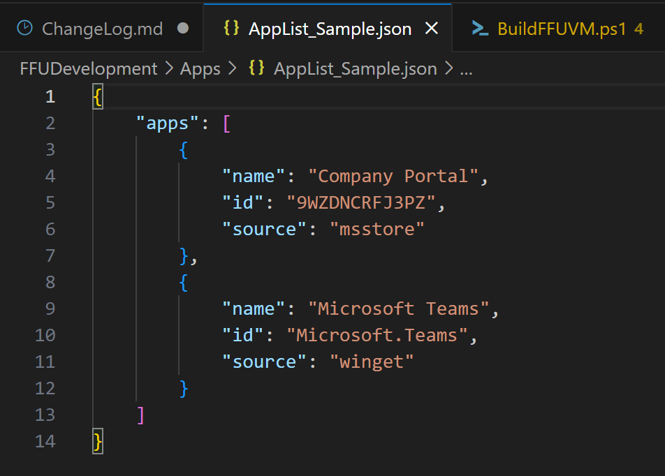
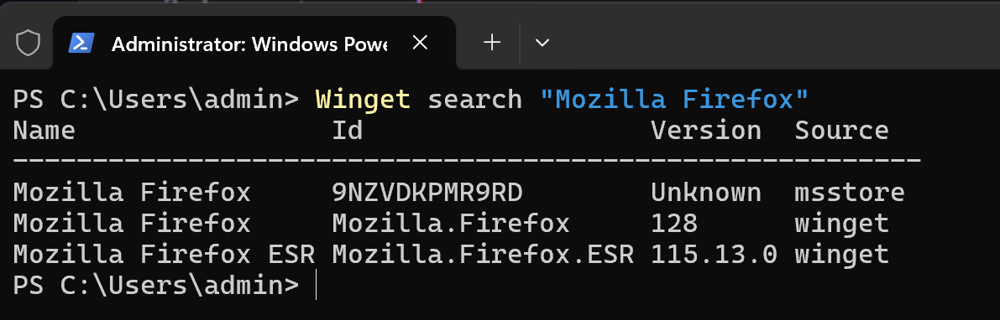
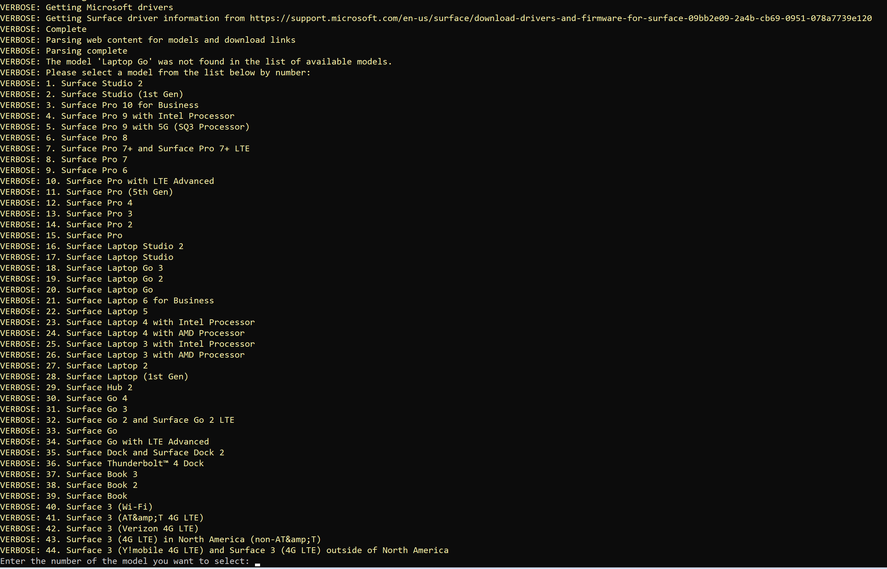
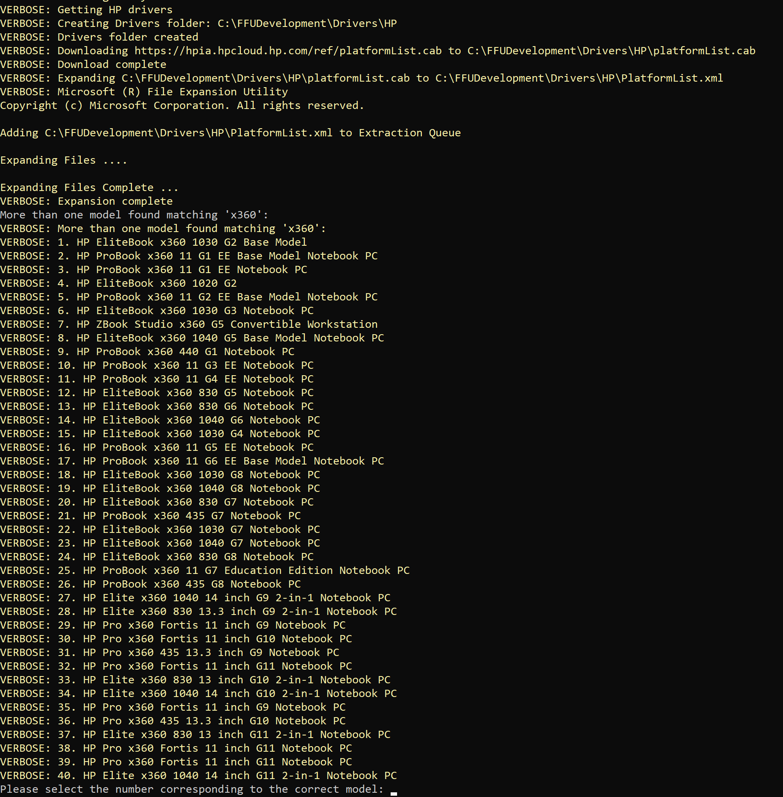
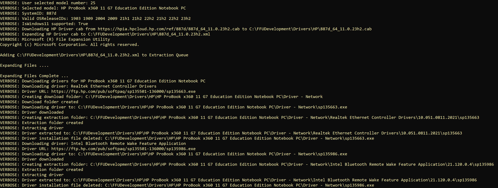
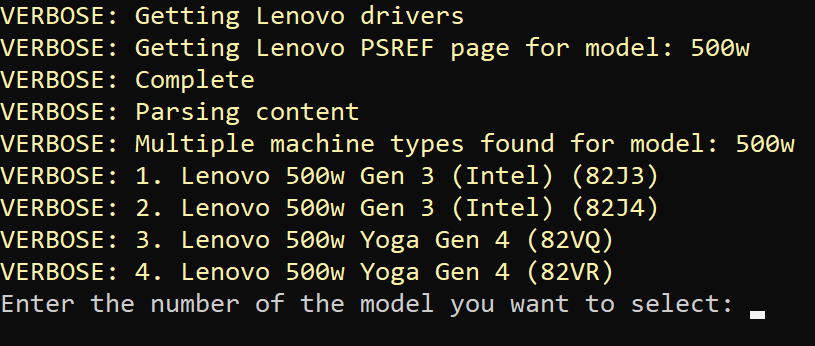
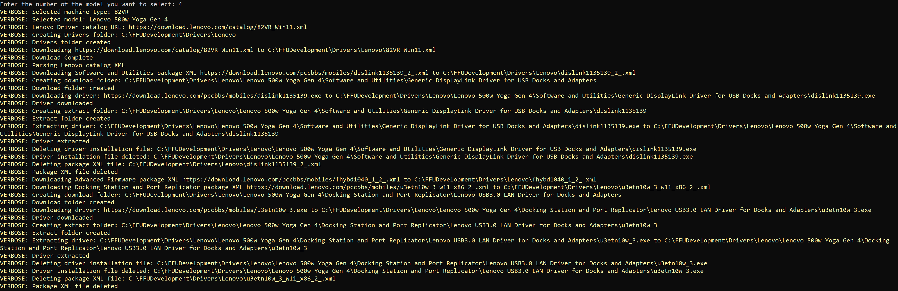
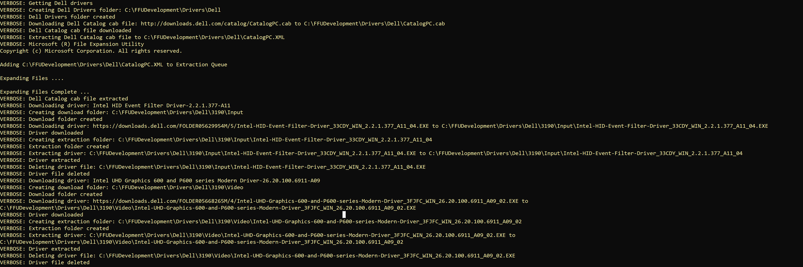

# Change Log

## **2407.1**

This is another major release that includes:

* Initial ARM64 support
* Winget support

### ARM64 Support

To support the newly released Copilot+ PCs, we now support the creation and deployment of FFUs created with ARM64 media. There are some caveats to this:

* The -WindowsArch parameter must be set to ARM64 (by default this parameter is set to x64)
* If you do not pass -ISOPath with a path to the ARM64 ISO, it will download an ARM64 ESD file from the Media Creation Tool (which is about 7-8 months old now). ARM64 ISOs are available via VLSC, but are not available via Visual Studio Downloads (Yet - unknown if they will ever be made available).
* The host machine you're building the FFU from must be ARM64
* Office/M365 apps don't currently support installing the ARM64 native bits from an offline system. If you pass `-InstallOffice $true`  the script will change the value to false. You can install office after the fact when connected to the internet. I'm investigating this behavior and will issue a fix if/when this gets resolved. I still don't recommend building the FFU VM on the internet.
* The [Defender Updates Site](https://www.microsoft.com/en-us/wdsi/defenderupdates) provides download links for Defender definitions. The ARM link doesn't work for ARM64 and mpam-fe.exe fails to install. However there might be an undocumented ARM64 URL that may work. I've included it, but haven't tested it as I'm writing these notes. So we'll see if that works out.
* Drivers - Surface Laptop 7 and Pro 11 don't have ARM64 drivers available yet (there are entries, but they just point to a .txt file). Other OEMs may have drivers available.

In all, testing has gone very well.

### Winget Support

Big thanks to [Zehadi Alam](https://github.com/zehadialam) for his contributions to get this added to the project. You can now add any application in the msstore or winget source via the Winget command line utility. In the 1.8 Winget release the ability to download apps from the msstore source was added, which means being able to download apps like the Company Portal. For those of you that have been asking for Company Portal to be inbox in Windows, this is the next best thing. The script will check if Winget 1.8 is installed and if not, it'll install it.

The way this works is if `-InstallApps $true`  and the FFUDevelopment\Apps\AppList.json file exists, whatever apps defined in that json file will be downloaded via Winget and will be installed in the FFU VM prior to capture. We've included two files: AppList_InboxAppsSample.json and AppList_Sample.json. The AppList_InboxAppsSample.json contains all of the apps that are installed in Windows by default and are searchable via `winget search AppID` . Some of these apps do not download and we're investigating why they come up via search, but fail to download. The AppList_Sample.json has Company Portal and New Teams.

In sticking with the idea of having the most up to date Windows build, inbox store/UWP apps are notoriously out of date and use a lot of bandwidth. By updating all of the UWP apps, bandwidth reductions of ~70% can be achieved.

|                                                                 | Total Data usage before updating store apps | Total Data usage after updating store apps | Total Data usage after updating Windows Update |
| --------------------------------------------------------------- | ------------------------------------------- | ------------------------------------------ | ---------------------------------------------- |
| July 2024 Windows 11 23H2 Stock ISO Captured as FFU (7.5GB FFU) | 261MB                                       | 1.82GB                                     | 2.09GB                                         |
| July 2024 Windows 11 23H2 Updated FFU (10.5GB)                  | 13MB                                        | 558MB                                      | 646MB                                          |

Updated means latest .NET, Defender (definition and platform updates), Edge, OneDrive, and all updates available via Winget for Store Apps have been provisioned in the FFU. The numbers in the table are cumulative, meaning the FFU was laid down, store apps were updated via running Get Apps from the Microsoft Store app and data usage was gathered from Settings, then Windows Update was manually kicked off via Settings and data usage was gathered.

In order to get apps to help build your AppList.json file, just run `winget search "AppName"`

In this example we see that Firefox is published to both the msstore and winget sources. It's up to you which one you'd like to pick (I assume the msstore and the 128 version from the winget source are both the same version, but that may not be the case). You'll want to use the Name, ID, and Source values to help create your AppList.json file.

When downloading msstore apps, it does require an Entra ID. If you're building your FFUs from a machine that is not signed in with an Entra ID, you will be prompted for credentials for each app you download AND for the license file for each app (2 prompts per app). If downloading many store apps is something you plan on doing, I highly recommend signing in with an Entra ID to prevent the authentication prompts.

Other improvements

* [mhaley](https://github.com/mhaley) made their first contribution to [assign the drive letter to the recovery partition when copying in a custom WinRE.wim](https://github.com/rbalsleyMSFT/FFU/pull/35)
* [MKellyCBSD](https://github.com/MKellyCBSD) submitted a PR for a stand-alone USBImagingToolCreator.ps1 script which will create USB drives separate from the main BuildFUVM.ps1 script. This is helpful if you have technicans that need to build USB drives, or would like to make concurrent USB drives at the same time instead of one at a time. [His PR has all the details.](https://github.com/rbalsleyMSFT/FFU/pull/36)
* The WinPE_FFU_Deploy.iso will now work on VMs. This made ARM64 testing a lot easier :) If you're looking to test your FFU on a VM, you'll want to build a new VHDX and add your FFU to it and boot from the WinPE_FFU_Deploy.iso. Make sure to eject the VHDX before adding/booting the new VM. When attaching the new VHDX with your FFU on it, make sure it's not the first SCSI device (it should be 1 or 2, most likely 2 as 0 should be the hard drive you want to install Windows to, and 1 will be the DVD drive). By default the WinPE_FFU_Deploy.iso file is removed after the script completes. Make sure to set `-CreateDeploymentMedia $true` and `-CleanupDeployISO $false` so the ISO remains in the FFUDevelopment folder after the script completes.

  The below screenshot should help in understanding what the SCSI config should look like.

  
* Cleaned up some old commented code from the ApplyFFU.ps1 file and other files.

## **2406.1**

This is a major release that includes the ability to download drivers from the 4 major OEMs (Microsoft, Dell, HP, Lenovo) by simply passing the -Make and -Model parameters to the command line.

For Dell, HP, and Lenovo, the script leverages a similar process to their corresponding tools that automate driver downloads (Dell SupportAssist, HP Image Assistant, Lenovo System Update/Update Retriever). For Microsoft Surface, it scrapes the Surface Downloads page for the appropriate MSI file to download. Using this method, the drivers that are downloaded will be the latest provided by the OEM, unlike other tools that download out of date enteprise CAB files that are made for ConfigMgr.

The script supports lookups using the -model parameter. For example, if you want to download the drivers for a Surface Laptop Go 3, but don't know the exact model name, you could set -Make 'Microsoft' -Model 'Laptop Go' and it'll give you a list of Surface devices to pick from. If you know the exact name, it'll use that and not prompt.

The goal here is to make it easy to discover the drivers you want to download without having to know the exact model names.

There are likely going to be bugs with this, but in my testing things seem to work well for the makes and models that I've tried. If you notice something, please fill out an issue in the repro and I'll take a look. If you want to fix whatever issue you're running into, submit a pull request.

### New parameters

| Parameter      | Type      | Description                                                                                                                                                                                                                                                                                                                               |
| -------------- | --------- | ----------------------------------------------------------------------------------------------------------------------------------------------------------------------------------------------------------------------------------------------------------------------------------------------------------------------------------------- |
| Make           | String    | Used for automatically downloading drivers. Valid values are 'Microsoft', 'Dell', 'HP', 'Lenovo'. The script will throw an error if any other string value is used.                                                                                                                                                                       |
| Model          | String    | Used for automatically downloading drivers with the Make parameter.                                                                                                                                                                                                                                                                       |
| DriversFolder  | String    | Location where Drivers will either be downloaded, and/or the location of the drivers you wish to be added to the FFU, or copied to the deploy partition of the USB drive. The default location is $FFUDevelopmentPath\Drivers (e.g. C:\FFUDevelopmentPath\Drivers                                                                         |
| CleanupDrivers | Bool      | Used to delete the drivers folders underneath the `$DriversFolder` path (e.g. C:\FFUDevelopmentPath\Drivers\HP) after the FFU has been built. Default is `$true`true                                                                                                                                                                  |
| UserAgent      | String    | The useragent string is used when invoking Invoke-Webrequest or Invoke-RestMethod. This has been helpful when interacting with the Microsoft Download Center and preventing intermittent errors. Default is Mozilla/5.0 (Windows NT 10.0; Win64; x64) AppleWebKit/537.36 (KHTML, like Gecko) Chrome/125.0.0.0 Safari/537.36 Edg/125.0.0.0 |
| Headers        | Hashtable | This hash table is used in conjunction with the Useragent when invoking Invoke-Webrequest or Invoke-RestMethod. This has been helpful when interacting with the Microsoft Download Center and preventing intermittent errors. If interested in the default value, reference the script itself.                                            |

### New Functions

### `Test-URL`

Simple function that accepts \$URL parameter to test if a URL is accessible.

### `Start-BitsTransferWithRetry`

This is simply Start-BITSTransfer with some retry logic and setting `$VerbosePreference` and `$ProgressPreference` to SilentlyContinue. The retry logic was needed due to certain driver files randomly failing to download. The function is hardcoded to retry 3 times before failing and will wait 5 seconds between each retry attempt.

### `Get-MicrosoftDrivers`

For Microsoft Surface, the driver files are hosted on the Microsoft download center. The script will scrape and parse the [Download Surface Drivers and Firmware](https://support.microsoft.com/en-us/surface/download-drivers-and-firmware-for-surface-09bb2e09-2a4b-cb69-0951-078a7739e120) page to get the latest list of Surface devices.

This function accepts -Make, -Model, and -WindowsRelease parameters. Make and Model are both string parameters and WindowsRelease is an integer parameter. If the model parameter doesn't contain an exact match of a known Surface model, it'll give you a list of Surface models to pick from.

The following command line says that we want to download the drivers for a Microsoft Laptop Go for Windows 10.

`.\BuildFFUVM.ps1 -make 'Microsoft' -model 'Laptop Go' -WindowsSKU 'Pro' -Installapps $true -InstallOffice $true -InstallDrivers $true -VMSwitchName 'external' -VMHostIPAddress '192.168.1.158' -CreateDeploymentMedia $true -BuildUSBDrive $true -UpdateLatestCU $true -UpdateLatestNet $true -UpdateLatestDefender $true -UpdateEdge $true -UpdateOneDrive $true -verbose -RemoveFFU $true -WindowsRelease 10`

If you want to build an FFU for Surface Laptop Go 3, enter 18 and it'll download the MSI and extract the drivers to the .\FFUDevelopment\Drivers\Microsoft\Surface Laptop Go 3 folder.

If you would have provided the exact model string instead of just Laptop Go (e.g. -Model 'Surface Laptop Go 3'), the script wouldn't prompt you to enter a valid model.

### `Get-HPDrivers`

For HP, the script uses the same process as the HP Image Assistant tool to automate the downloading of drivers. This function accepts the -Make, -Model, -WindowsArch, -WindowsRelease, and -WindowsVersion parameters. HP is the only vendor that uses -WindowsVersion (e.g. 23h2) for its drivers. This is because their XML files contain the -WindowsVersion value in the file name. By default, the script uses 23h2 for the -WindowsVersion parameter. You can override that for whatever -WindowsVersion you wish to use.

The following command line says that we want to download HP x360 drivers for Windows 10 version 22h2.

`.\BuildFFUVM.ps1 -make 'HP' -model 'x360' -WindowsSKU 'Pro' -Installapps $true -InstallOffice $true -InstallDrivers $true -VMSwitchName 'external' -VMHostIPAddress '192.168.1.158' -CreateDeploymentMedia $true -CreateCaptureMedia $true -BuildUSBDrive $true -UpdateLatestCU $true -UpdateLatestNet $true -UpdateLatestDefender $true -UpdateEdge $true -UpdateOneDrive $true -RemoveFFU $true -WindowsRelease 10 -WindowsVersion '22h2' -Verbose`

HP has 40 models that contain the string x360 in the model name. I want to select the HP ProBook x360 11 G7 Education Edition Notebook PC which is number 25. The below screenshot shows the output of selecting the HP ProBook x360 11 G7 Education Edition Notebook PC

If you were to enter the exact model name (e.g. -model 'HP ProBook x360 11 G7 Education Edition Notebook PC'), the script wouldn't prompt you to select from a list of models.

### `Get-LenovoDrivers`

For Lenovo, the script uses the same process Lenovo System Update/Update Retriever use. It uses the Get-LenovoDrivers function which accepts -Model, -WindowsArch, -WindowsRelease parameters.

Lenovo as a company doesn't use model like other companies do. Lenovo prefers to use a Machine Type value instead of Model number. The Machine Type value can be found on the bottom of your device as the first four characters of the MTM: value. Since most people don't know what the machine type value is, when passing the -model parameter, you can pass either the machine type or the "friendly" model number.

The following command line says that we want to download Lenovo 500w drivers for Windows 10.

`.\BuildFFUVM.ps1 -make 'Lenovo' -model '500w' -WindowsSKU 'Pro' -Installapps $true -InstallOffice $true -InstallDrivers $true -VMSwitchName 'external' -VMHostIPAddress '192.168.1.158' -CreateDeploymentMedia $true -BuildUSBDrive $true -UpdateLatestCU $true -UpdateLatestNet $true -UpdateLatestDefender $true -UpdateEdge $true -UpdateOneDrive $true -RemoveFFU $true -WindowsRelease 10 -Verbose`

The script will go out to the [Lenovo PSREF](https://psref.lenovo.com/search) page to figure out the Machine Type value and if multiple Machine Types are found (there are usually multiples found for different configuration types).

The Machine Type is the value in parenthesis. On the bottom of my device, the MTM value is MTM:**82VR**ZAKXXX. I would want to pick number 4 from the list since it includes (82VR). The below screenshot shows the script downloading the appropriate drivers for a Lenovo 500w.

If you use the Machine Type value for the -Model parameter (e.g. -model '82VR') the script will automatically download the drivers without prompting you to select the model.

### `Get-DellDrivers`

For Dell, the script uses the [Dell CatalogPC Cab file](http://downloads.dell.com/catalog/CatalogPC.cab) which is used in Dell Support Assist and possibly other Dell tools to download drivers. The cab consists of an XML file that the script parses to search for drivers applicable for the model you wish to create a FFU for.

The script calls the Get-DellDrivers function which accepts the -Model and -WindowsArch parameters.

Unlike Microsoft Surface drivers, Dell doesn't give a list to pick from when the -model parameter isn't an exact match. This is due to how the CatalogPC XML file lists drivers. It treats the driver as the primary element and lists what models that driver can be installed on.

The following command line says that we want to download Dell 3190 drivers for Windows 10.

`.\BuildFFUVM.ps1 -make 'Dell' -model '3190' -WindowsSKU 'Pro' -Installapps $true -InstallOffice $true -InstallDrivers $true -VMSwitchName 'external' -VMHostIPAddress '192.168.1.158' -CreateDeploymentMedia $true -CreateCaptureMedia $true -BuildUSBDrive $true -UpdateLatestCU $true -UpdateLatestNet $true -UpdateLatestDefender $true -UpdateEdge $true -UpdateOneDrive $true -RemoveFFU $true -WindowsRelease 10 -Verbose`

The script will find every driver that is tagged with 3190 and download the latest available version. It strips out any firmware or other non-driver file types. You may notice that it will download multiple video or audio drivers. This is due to each model having variants with different video cards or other hardware. This would make the FFU a bit larger, but not excessively so.

Below is a screenshot of what the verbose output of the script looks like when downloading the drivers for a Dell 3190.

* Added -Headers \$Headers -UserAgent \$UserAgent to most Invoke-Webrequest or Invoke-RestMethod commands to solve for intermittent download failures when downloading drivers or Office
* Fixed some minor logging issues
* Updated the BuildDeployFFU.docx with new driver information and cleaned up some sections that were out of date
* Added Changelog.md to keep track of changes and not clutter up the readme.md

## **2405.1**

- Moved the resetbase command from within the VM to after servicing the VHDX. This will make it so the FFU size is smaller after the latest CU or .NET framework are installed. (Thanks to Mike Kelly for the PR [Commit](https://github.com/rbalsleyMSFT/FFU/pull/24))
- Some additional FFU size reduction enhancements (Thanks Zehadi Alam [Commit](https://github.com/rbalsleyMSFT/FFU/pull/25)):
  - Disk cleanup is now run before sysprep to help reduce FFU file size
  - Before FFU capture, Optimize-FFU is run to defrag and slabconsolidate the VHDX

## **2404.3**

- Fixed an issue where the latest Windows CU wasn't downloading properly [Commit](https://github.com/rbalsleyMSFT/FFU/commit/ae59183a199f39b310c79b31c9b4980fafdeb79b)

## **2404.2**

- If setting `-installdrivers to $true` and `-logicalsectorsizebytes to 4096`, the script will now set `$copyDrivers to $true`. This will create a drivers folder on the deploy partition of the USB drive with the drivers that were supposed to be added to the FFU. There's currently a bug with servicing FFUs with 4096 logical sector byte sizes. Prior to this fix, the script would tell the user to manually set `-copydrivers to $true` as workaround. This fix just does the workaround automatically.

## **2404.1**

There's a big change with this release related to the ADK. The ADK will now be automatically updated to the latest ADK release. This is required in order to fix an issue with optimized FFUs not applying due to an issue with DISM/FFUProvider.dll. The FFUProvider.dll fix was added to the Sept 2023 ADK. Since we now have the ability to auto upgrade the ADK, I'm more confident in having the BuildFFUVM script creating a complete FFU now (prior it was only creating 3 partitions instead of 4 with the recovery partition - at deployment time, the ApplyFFU.ps1 script would create an empty recovery partition and Windows would populate it on first boot). Please open an issue if this creates a problem for you. I do realize that any new ADK release can have it's own challenges and issues and I do suspect we'll see a new ADK released later this year.

- Allow for ISOs with single index WIMs to work [Issue 10](https://github.com/rbalsleyMSFT/FFU/issues/10) - [Commit](https://github.com/rbalsleyMSFT/FFU/commit/9e2da741d53652e6e600ca19cfd38f507bd01fde)
- Added more robust ADK handling. Will now check for the latest ADK and download it if not installed. Thanks to [Zehadi Alam](https://github.com/zehadialam) [PR 18](https://github.com/rbalsleyMSFT/FFU/pull/18)
- Revert code back to allow optimized FFUs to be applied via ApplyFFU.ps1 now that Sept 2023 ADK release has FFUProvider.dll fix. [Commit](https://github.com/rbalsleyMSFT/FFU/commit/79364e334d6d09ff150e70dab7bfb2637d0ad8a8)
- Changed how the script searches for the latest CU. Instead of relying on the Windows release info page to grab the KB number, will just use the MU Catalog, the same as what we do for the .NET Framework. Windows release info page is updated manually and is unknown as to when it will be updated. [Commit](https://github.com/rbalsleyMSFT/FFU/commit/6fd5a4a41fd9ce2f842f43dc3a69bda264c29fa6)
- Added fix to not allow computer names with spaces. Thanks to [JoeMama54 (Rob)](https://github.com/JoeMama54) [PR 20](https://github.com/rbalsleyMSFT/FFU/pull/20)

## **2403.1**

Fixed an issue with the SecurityHealthSetup.exe file giving an error when building the VM if -UpdateLatestDefender was set to $true. A new update for this came out on 3/21 which included a x64 and ARM64 binary. This file doesn't have an architecture designation to it, so it's impossible to know which file is for which architecture. Investigating to see if we can fix this in the Microsoft Update catalog. There is a web site to pull this from, but the support article is out of date.

Included ADK functions from Zehadi Alam [Introduce Automated ADK Retrieval and Installation Functions #14](https://github.com/rbalsleyMSFT/FFU/pull/14) to automate the installation of the ADK if it's not present. Thanks, Zehadi!

## **2402.1**

**New functionality**

* If -BuildUSBDrve $true, script will now check for USB drive before continuing. If not present, script exits
* Added a number of new parameters.

| Parameter            | Type | Description                                                                                                                                                              |
| -------------------- | ---- | ------------------------------------------------------------------------------------------------------------------------------------------------------------------------ |
| CopyPEDrivers        | Bool | When set to\$true, will copy the drivers from the \$FFUDevelopmentPath\PEDrivers folder to the WinPE deployment media. Default is \$false.                               |
| RemoveFFU            | Bool | When set to\$true, will remove the FFU file from the\$FFUDevelopmentPath\FFU folder after it has been copied to the USB drive. Default is \$false.                       |
| UpdateLatestCU       | Bool | When set to\$true, will download and install the latest cumulative update for Windows 10/11. Default is \$false.                                                         |
| UpdateLatestNet      | Bool | When set to\$true, will download and install the latest .NET Framework for Windows 10/11. Default is \$false.                                                            |
| UpdateLatestDefender | Bool | When set to\$true, will download and install the latest Windows Defender definitions and Defender platform update. Default is \$false.                                   |
| UpdateEdge           | Bool | When set to\$true, will download and install the latest Microsoft Edge for Windows 10/11. Default is \$false.                                                            |
| UpdateOneDrive       | Bool | When set to\$true, will download and install the latest OneDrive for Windows 10/11 and install it as a per machine installation instead of per user. Default is \$false. |
| CopyPPKG             | Bool | When set to\$true, will copy the provisioning package from the \$FFUDevelopmentPath\PPKG folder to the Deployment partition of the USB drive. Default is \$false.        |
| CopyUnattend         | Bool | When set to\$true, will copy the \$FFUDevelopmentPath\Unattend folder to the Deployment partition of the USB drive. Default is \$false.                                  |
| CopyAutopilot        | Bool | When set to\$true, will copy the \$FFUDevelopmentPath\Autopilot folder to the Deployment partition of the USB drive. Default is \$false.                                 |
| CompactOS            | Bool | When set to\$true, will compact the OS when building the FFU. Default is \$true.                                                                                         |
| CleanupCaptureISO    | Bool | When set to\$true, will remove the WinPE capture ISO after the FFU has been captured. Default is \$true.                                                                 |
| CleanupDeployISO     | Bool | When set to\$true, will remove the WinPE deployment ISO after the FFU has been captured. Default is \$true.                                                              |
| CleanupAppsISO       | Bool | When set to\$true, will remove the Apps ISO after the FFU has been captured. Default is \$true.                                                                          |

* Updated the docs with the new variables and made some minor modifications.
* Changed version variable to 2402.1

## **2401.1**

- Added -CopyDrivers boolean parameter to control the ability to copy drivers to the USB drive in the deploy partition drivers folder.
- Changed version varaible to 2401.1
- When creating the scratch VHDX, switched it to create a dynamic VHDX instead of fixed
- Fixed an issue where adding drivers to the FFU would sometimes fail and would cause the script to exit unexpectedly
- Added -optimize boolean parameter to control whether the FFU is optimized or not. This defaults to $true and in most cases should be left this way.
- Fixed an issue where if the script failed to create the FFU and the old VM was left behind, it wouldn't clean it up if the VM was in the running state. Will now turn off any running VM with a name prefix of _FFU- and then remove any VMs with a name _FFU- if the environment is flagged as dirty.
- Fixed an issue where devices that ship with UFS drives were unable to image due to the script setting a LogicalSectorSizeBytes value of 512. If you're creating a FFU for devices that have UFS drives, you'll need to set -LogicalSectorSizeBytes 4096.
- There's a known issue where adding drivers to a FFU that has a LogicalSectorSizeBytes value of 4096. Added some code to prevent allowing this to happen. Please use -copydrivers $true as a workaround for now. We're investigating whether this is a bug or not.
- Fixed an issue where VHDX only captures (i.e. where -installapps $false) would not install Windows updates.
- Changed Office deployment to use Current channel instead of Monthly enterprise. If you want to change to Monthly Enterprise channel, it's recommended to leverage Intune.

## **2309.2**

New Features

**Multiple USB Drive Support**

You can now plug in multiple USB drives (even using a USB hub) to create multiple USB drives for deployment. This is great for partners or customers who need to provide USB drives to their employees to image a large number of devices. It will copy the content to one USB drive at a time. The most USB drives we've seen created so far is 23 via a USB hub. Open an issue if you see any problems with this.

**Robocopy support**

Replaced Copy-Item with Robocopy when copying content to the USB drive(s). Copy-Item uses buffered IO, which can take a long time to copy large files. Robocopy with the /J switch allows for unbuffered IO support, which reduces the amount of time to copy.

**Better error handling**

Prior to 2309.2, if the script failed or you manually killed the script (ctrl+c, or closing the PowerShell window), the environment would end up in a bad state and you had to do a number of things to manually clean up the environment. Added a new function called Get-FFUEnvironment and a new text file called dirty.txt that gets created in the FFUDevelopment folder. When the script starts, it checks for the dirty.txt file and if it sees it, Get-FFUEnvironment runs and cleans out a number of things to help ensure the next run will complete successfully. Open an issue if you still see problems when the script fails and the next run of the script fails. 

Bug Fixes

- In 2309.1, added a 15 second sleep to allow for the registry to unload to fix a Critical Process Died error on deployment. In this build, increased that to 60 seconds.
- Fixed an issue where the script was incorrectly detecting the USB drive boot and deploy drive letters which caused issues when attempting to copy the WinPE files to the boot partition.

## **2309.1**

- Fixed an issue with a Critical Process Died BSOD that would happen when using -installapps $false. More detailed information in the [commit](https://github.com/rbalsleyMSFT/FFU/pull/2/commits/34efbda7ec56dc7cb43ac42b058725d56c8b8899)

## **2306.1.2**

- Fixed an issue where manually entering a name wouldn't name the computer as expected

## **2306.1.1**

- Included some better error handling if defining optionalfeatures that require source folders (netfx3). ESD files don't have source folders like ISO media, which means installing .net 3.5 as an optional feature would fail. Also cleaned up some formatting.

## **2306.1**

- Added support to automatically download the latest Windows 10 or 11 media via the media creation tool (thanks to [Michael](https://oofhours.com/2022/09/14/want-your-own-windows-11-21h2-arm64-isos/) for the idea). This also allows for different architecture, language, and media type support. If you omit the -ISOPath, the script will download the Windows 11 x64 English (US) consumer media.

  An example command to download Windows 11 Pro x64 English (US) consumer media with Office and install drivers (it won't download drivers, you'll put those in your c:\FFUDevelopment\Drivers folder)

  .\BuildFFUVM.ps1 -WindowsSKU 'Pro' -Installapps $true -InstallOffice $true -InstallDrivers $true -VMSwitchName 'Name of your VM Switch in Hyper-V' -VMHostIPAddress 'Your IP Address' -CreateCaptureMedia $true -CreateDeploymentMedia $true -BuildUSBDrive $true -verbose

  An example command to download Windows 11 Pro x64 French (CA) consumer media with Office and install drivers

  .\BuildFFUVM.ps1 -WindowsSKU 'Pro' -Installapps $true -InstallOffice $true -InstallDrivers $true -VMSwitchName 'Name of your VM Switch in Hyper-V' -VMHostIPAddress 'Your IP Address' -CreateCaptureMedia $true -CreateDeploymentMedia $true -BuildUSBDrive $true -WindowsRelease 11 -WindowsArch 'x64' -WindowsLang 'fr-ca' -MediaType 'consumer' -verbose
- Changed default size of System/EFI partition to 260MB from 256MB to accomodate 4Kn drives. 4Kn support needs more testing. I'm not confident yet that this can be done with VMs and FFUs.
- Added versioning with a new version parameter. Using YYMM as the format followed by a point release.
