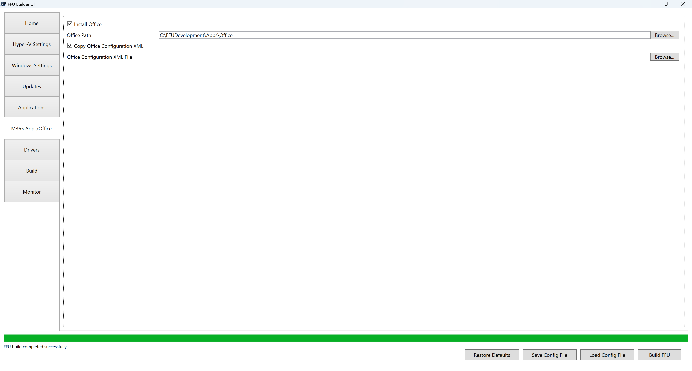

# M365 Apps/Office



FFU Builder uses the Office Deployment Toolkit (ODT) to install Office. In the `.\FFUDevelopment\Apps\Office` folder you'll find two files:

* `DownloadFFU.xml`
* `DeployFFU.xml`

## DownloadFFU.xml

`DownloadFFU.xml` is responsible for the download of Office. It's invoked by `setup.exe /download .\DownloadFFU.xml` during the build process. It defaults to downloading the current channel 64-bit version of Office matching the current OS language to `C:\FFUDevelopment\Apps\Office`.

`DownloadFFU.xml` contents:

```
<Configuration ID="efa6df21-a106-428e-8eaa-d89a5dda6030">
  <Add SourcePath="C:\FFUDevelopment\Apps\Office" OfficeClientEdition="64" Channel="Current">
    <Product ID="O365ProPlusRetail">
      <Language ID="MatchOS" />
    </Product>
  </Add>
</Configuration>
```

If you want to modify the language, you'll need to change the language ID to the language you wish to download and install.

For more information about deploying languages see: [Overview of deploying languages for Microsoft 365 Apps - Microsoft 365 Apps Microsoft Learn](https://learn.microsoft.com/en-us/microsoft-365-apps/deploy/overview-deploying-languages-microsoft-365-apps)

## DeployFFU.xml

`DeployFFU.xml` is responsible for customizing the installation of Office. If you don't provide a custom XML, it will default to using what's in `DeployFFU.xml`. The default configuration will install the 64-bit current channel version of Office with Word, Excel, Powerpoint. Below is what's currently in `DeployFFU.xml`:

```
<Configuration ID="efa6df21-a106-428e-8eaa-d89a5dda6030">
  <Add OfficeClientEdition="64" Channel="Current">
    <Product ID="O365ProPlusRetail">
      <Language ID="MatchOS" />
      <ExcludeApp ID="Access" />
      <ExcludeApp ID="Lync" />
      <ExcludeApp ID="Publisher" />
      <ExcludeApp ID="Bing" />
      <ExcludeApp ID="Teams" />
      <ExcludeApp ID="Outlook" />
    </Product>
  </Add>
  <Property Name="SharedComputerLicensing" Value="0" />
  <Property Name="FORCEAPPSHUTDOWN" Value="FALSE" />
  <Property Name="DeviceBasedLicensing" Value="0" />
  <Property Name="SCLCacheOverride" Value="0" />
  <Updates Enabled="TRUE" />
  <Display Level="None" AcceptEULA="TRUE" />
</Configuration>
```

## Copy Office Configuration XML

If you want to include your own custom XML file for office, check **Copy Office Configuration XML** and browse to the location of your custom XML file. The path to your custom Office configuration XML file is stored in the `OfficeConfigXMLFile` parameter. This file gets added to the `.\FFUDevelopment\Apps\Office` folder and is referenced in the `.\FFUDevelopment\Apps\Orchestration\Install-Office.ps1` file. 


