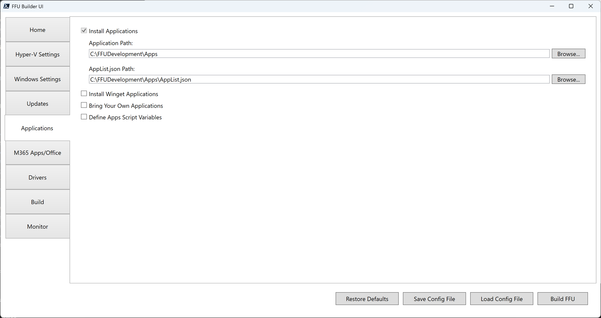

# Applications

Applications can be installed in three different ways:

* Winget (using an AppList.json file)
* Bring Your Own Applications (using files you provide - can also be used to run command lines with or without content)
* Apps Script Variables (key/value pairs used in conjunction with a PowerShell script to install custom applications)


