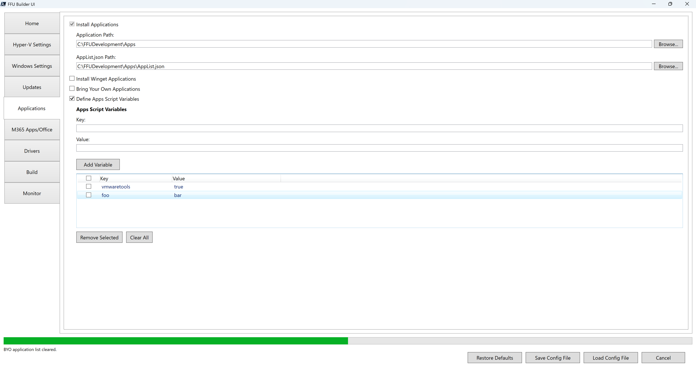

# Apps Script Variables



Apps Script Variables are key value pairs that are used to create a hashtable that is passed to the `BuildFFUVM.ps1` script (stored in the `$AppScriptVariables` parameter as a hashtable). At build time, `BuildFFUVM.ps1` will export the `$AppsScriptVariables` hashtable to an `AppsScriptVariables.json` file in the `$OrchestrationPath` folder (`$AppsPath\Orchestration`). You can also manually create your own `AppsScriptVariables.json `file and place it in the `$AppsPath\Orchestration` folder.

In the VM, the `Orchestrator.ps1` file will call `Invoke-AppsScript.ps1` if `AppsScriptVariables.json` exists. `Invoke-AppsScript.ps1` must be modified to handle your variables.

`Invoke-AppsScript.ps1` has the following commented example of how to modify the file:

```
# Example of how to use the AppsScriptVariables hashtable to control script execution

# Note: The UI saves the values as strings, so if you type true for a value, it'll save to the config file as a string, not boolean

# Example: Check if a variable named 'foo' is set to string 'bar' and run a script accordingly
# if ($AppsScriptVariables['foo'] -eq 'bar') {
#     Write-Host "Foo would have installed"
# }
# else {
#     Write-Host "Foo would not have installed"
# }

# Example: Check if a variable named 'Teams' is set to string 'true' and run a script accordingly
# if ($AppsScriptVariables['Teams'] -eq 'true') {
#     Write-Host "Teams would have been installed"
# }
# else {
#     Write-Host "Teams would not have been installed"
# }
```

## Why use Apps Script Variables?

This allows for you to create a dynamic task sequence via a PowerShell script with simple if statements to run apps, commands, etc. This is all driven by your `FFUConfig.json` file. For example, the following `FFUConfig.json` file contains an AppsScriptVariables hashtable of foo and vmwaretools like the screenshot above. If you build servers that require vmware tools, you may set the value to true. However there may be situations where you don't need vmwaretools installed. If that's the case, you set vmwaretools to false. This allows for your `Invoke-AppsScript.ps1` file to stay the same and all you have to do is adjust the variables.

```
{
  "AdditionalFFUFiles": [],
  "AllowExternalHardDiskMedia": false,
  "AllowVHDXCaching": false,
  "AppListPath": "C:\\FFUDevelopment\\Apps\\AppList.json",
  "AppsPath": "C:\\FFUDevelopment\\Apps",
  "AppsScriptVariables": {
    "foo": "bar",
    "vmwaretools": "true"
  },
  "BuildUSBDrive": false,
  "CleanupAppsISO": true,
  "CleanupCaptureISO": true,
  "CleanupDeployISO": true,
  "CleanupDrivers": false,
  "CompactOS": true,
  "CompressDownloadedDriversToWim": false,
  "CopyAdditionalFFUFiles": false,
  "CopyAutopilot": false,
  "CopyDrivers": false,
  "CopyOfficeConfigXML": false,
  "CopyPEDrivers": false,
  "CopyPPKG": false,
  "CopyUnattend": false,
  "CreateCaptureMedia": true,
  "CreateDeploymentMedia": true,
  "CustomFFUNameTemplate": "{WindowsRelease}_{WindowsVersion}_{SKU}_{yyyy}-{MM}-{dd}_{HH}{mm}",
  "Disksize": 53687091200,
  "DownloadDrivers": false,
  "DriversFolder": "C:\\FFUDevelopment\\Drivers",
  "DriversJsonPath": "C:\\FFUDevelopment\\Drivers\\Drivers.json",
  "FFUCaptureLocation": "C:\\FFUDevelopment\\FFU",
  "FFUDevelopmentPath": "C:\\FFUDevelopment",
  "FFUPrefix": "_FFU",
  "InjectUnattend": false,
  "InstallApps": true,
  "InstallDrivers": false,
  "InstallOffice": false,
  "InstallWingetApps": false,
  "ISOPath": "",
  "LogicalSectorSizeBytes": 512,
  "MaxUSBDrives": 5,
  "MediaType": "Consumer",
  "Memory": 4294967296,
  "OfficeConfigXMLFile": "",
  "OfficePath": "C:\\FFUDevelopment\\Apps\\Office",
  "Optimize": true,
  "OptionalFeatures": "",
  "OrchestrationPath": "C:\\FFUDevelopment\\Apps\\Orchestration",
  "PEDriversFolder": "C:\\FFUDevelopment\\PEDrivers",
  "Processors": 4,
  "ProductKey": "",
  "PromptExternalHardDiskMedia": true,
  "RemoveApps": false,
  "RemoveFFU": false,
  "RemoveUpdates": false,
  "ShareName": "FFUCaptureShare",
  "Threads": 5,
  "UpdateADK": true,
  "UpdateEdge": true,
  "UpdateLatestCU": true,
  "UpdateLatestDefender": true,
  "UpdateLatestMicrocode": false,
  "UpdateLatestMSRT": true,
  "UpdateLatestNet": true,
  "UpdateOneDrive": true,
  "UpdatePreviewCU": false,
  "USBDriveList": {},
  "UseDriversAsPEDrivers": false,
  "UserAppListPath": "C:\\FFUDevelopment\\Apps\\UserAppList.json",
  "Username": "ffu_user",
  "Verbose": false,
  "VMHostIPAddress": "192.168.1.169",
  "VMLocation": "C:\\FFUDevelopment\\VM",
  "VMSwitchName": "External",
  "WindowsArch": "x64",
  "WindowsLang": "en-us",
  "WindowsRelease": 11,
  "WindowsSKU": "Pro",
  "WindowsVersion": "25H2"
}

```

Example command line to run with vmwaretools set to false and foo set to foo. This will create the `AppsScriptVariables.json` file in the Orchestration folder with the updated values of `foo=foo` and `vmwaretools=false` without the need to modify the config file.

`.\BuildFFUVM.ps1 -configFile 'C:\FFUDevelopment\config\FFUConfig.json' -appsScriptVariables @{foo='foo'; vmwaretools='false'}`



