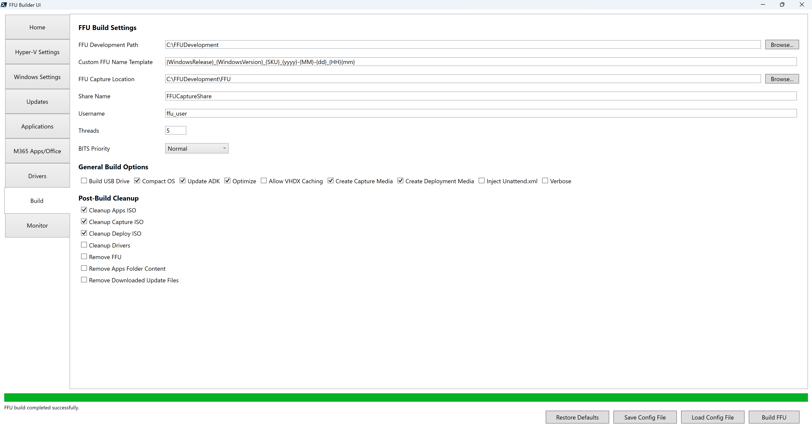

# Build



The Build tab is where the magic happens

## FFU Development Path

The FFU Development path (`$FFUDevelopmentPath`) is the root path of where most other paths are derived. The default is `$PSScriptRoot`, which is the location the script is currently running from and can be changed to another location from within the UI.

If you want to download and test new releases, or want to create a new FFUDevelopment folder without modifying your existing one, you can always download the source files and put them in another location.

The recommendation is to run from `C:\FFUDevelopment` and in most cases the path shouldn't need to be changed.

## Custom FFU Name Template

Controls the `-CustomFFUNameTemplate` parameter. This allows you to define a custom naming convention for the captured FFU file using placeholders that are replaced at build time.

If left blank, the default FFU naming convention is used.

### Available Placeholders

| Placeholder          | Description            | Example                                                                        |
| -------------------- | ---------------------- | ------------------------------------------------------------------------------ |
| `{WindowsRelease}` | Windows release number | `10`, `11`, `2016`, `2019`, `2022`, `2025`                         |
| `{WindowsVersion}` | Windows version        | `1607`, `1809`, `21h2`, `22h2`, `23h2`, `24h2`                     |
| `{SKU}`            | Windows edition        | `Home`, `Pro`, `Enterprise`, `Education`, `Standard`, `Datacenter` |
| `{BuildDate}`      | Month and year         | `Nov2025`                                                                    |
| `{yyyy}`           | 4-digit year           | `2025`                                                                       |
| `{MM}`             | 2-digit month          | `11` (for November)                                                          |
| `{dd}`             | 2-digit day            | `28`                                                                         |
| `{HH}`             | Hour in 24-hour format | `14` (for 2 PM)                                                              |
| `{hh}`             | Hour in 12-hour format | `02` (for 2 PM)                                                              |
| `{mm}`             | 2-digit minute         | `09`                                                                         |
| `{tt}`             | AM/PM designator       | `AM` or `PM`                                                               |

### Examples

**Basic template with date and time:**

```
{WindowsRelease}_{WindowsVersion}_{SKU}_{yyyy}-{MM}-{dd}_{HH}{mm}
```

Result: `Win11_24h2_Pro_2025-11-28_1425.ffu`

**Template with static text (e.g., indicating Office is installed):**

```
{WindowsRelease}_{WindowsVersion}_{SKU}_Office_{yyyy}-{MM}-{dd}_{HH}{mm}
```

Result: `Win11_24h2_Pro_Office_2025-11-28_1425.ffu`

**Simple template with build date:**

```
{WindowsRelease}_{WindowsVersion}_{SKU}_{BuildDate}
```

Result: `Win11_24h2_Pro_Nov2025.ffu`

{: .note-title}

> Note
>
> The `.ffu` extension is automatically appended if not included in the template.

## FFU Capture Location

The FFU Capture Location sets the `-FFUCaptureLocation` parameter that determines where completed `.ffu` images are written. By default it points to `$FFUDevelopmentPath\FFU`, and the build script creates the folder automatically if it does not already exist.

When apps are installed in a VM, the host converts this folder into a temporary SMB share using the **Share Name** and **Username** fields. The capture WinPE environment maps that share as drive `W:` and streams the captured image directly into this folder. When the build finishes, the share and local account are removed, but the FFU files remain unless a cleanup option deletes them.

Choose a path on fast storage with plenty of free space—the directory must be local to the host running `BuildFFUVM.ps1`, and large captures can easily exceed 25–30 GB. This location also feeds other options such as **Copy Additional FFU Files**, **Build USB Drive**, and **Remove FFU**, so keeping all finished images here keeps those workflows simple.

## Share Name

The Share Name sets the `-ShareName` parameter that defines the name of the temporary SMB share created during the FFU capture process. The default is `FFUCaptureShare`.

During the build, the host creates an SMB share that points to the **FFU Capture Location** and grants access to the temporary local user account defined in **Username**. The capture WinPE environment maps this share as drive `W:` using `net use` and streams the captured FFU image directly to it.

When the build completes, the share is automatically removed along with the temporary user account, leaving only the captured FFU files behind in the FFU Capture Location.

## Username

The Username field sets the `-Username` parameter that `BuildFFUVM.ps1` uses when creating the temporary SMB share user. The value becomes a local standard user account that is granted Full Control on the **FFU Capture Location** share (default C:\FFUDevelopment\FFU) so the capture WinPE session can copy the FFU over `net use `. The default `ffu_user` account name works for most scenarios, but you can supply any other local account name that meets your organization's policies.

When the build starts, the script ensures the account exists, rotates its password to a randomly generated GUID, and grants it access to the share. The Capture WinPE environment maps drive `W:` with those credentials, then writes the captured image directly into the FFU Capture Location.

After the build finishes, the share is removed and the temporary account is deleted, leaving only the FFU files stored in the capture folder.

## Threads

Controls the `-Threads` parameter, which sets the number of parallel threads used for concurrent operations throughout FFU Builder. The default value is **5**.

### Operations Affected by Threads

The Threads value applies to the following parallel operations:

| Operation                              | Description                                                                                                      |
| -------------------------------------- | ---------------------------------------------------------------------------------------------------------------- |
| **Winget Application Downloads** | When downloading multiple Winget applications, each application download runs as a parallel task                 |
| **BYO Application Copy**         | When copying multiple Bring Your Own (BYO) applications to the Apps folder, each copy operation runs in parallel |
| **Driver Downloads**             | When downloading drivers for multiple device models, each driver download and extraction runs as a parallel task |

### Recommended Values

| Threads        | Use Case                                                                  |
| -------------- | ------------------------------------------------------------------------- |
| **1**    | Minimal system impact; useful for troubleshooting or low-resource systems |
| **5**    | Default; balanced performance for most systems                            |
| **8-10** | Higher concurrency for systems with fast storage and network connections  |

{: .note-title}

> Note
>
> Setting a higher thread count may improve download times but will increase resource utilization. If you experience stability issues or resource constraints, try reducing the thread count.

### Validation

The UI validates that the Threads value is a valid integer greater than or equal to 1. If an invalid value is entered, it automatically resets to **1**.

## BITS Priority

Controls the `-BitsPriority` parameter, which determines the priority level for Background Intelligent Transfer Service (BITS) downloads. The default value is **Normal**.

If you want faster downloads, change the priority to Foreground. Normal priority will significantly slow down downloads since BITS treats non-Foreground downloads as synchronous and queues each download. This means multiple driver or winget application downloads will go much slower than using Foreground. Normal is default as per Microsoft best practice guidance for using BITS.

## Build USB Drive

The following sub-options control how the USB drive is created

### Allow External Hard Disk Media

Controls the `-AllowExternalHardDiskMedia` parameter. When checked, allows the use of drives identified as "External hard disk media" via the WMI class `Win32_DiskDrive`. The default is **unchecked**.

Most USB thumb drives are identified by Windows as "Removable Media" and work with the default settings. However, faster USB drives—such as portable SSDs or high-speed USB 3.x drives—may be identified as "External hard disk media" instead. If you want to use these faster drives for imaging, enable this option.

{: .warning-title}

> Warning
>
> Enabling this option may expose external hard drives attached to your machine to the USB imaging process. To prevent accidental data loss, use the **Prompt for External Hard Disk Media** option (enabled by default when this option is checked) to confirm which drive to use before formatting.

### Prompt for External Hard Disk Media

Controls the `-PromptExternalHardDiskMedia` parameter. When checked, prompts for user confirmation before using any drive identified as "External hard disk media". The default is **checked** when **Allow External Hard Disk Media** is enabled.

This option is only available when **Allow External Hard Disk Media** is checked.

When enabled, the build process will:

1. Display a table listing all detected external hard disk media drives, including drive name, serial number, partition style, and status.
2. Prompt you to select which drive to use for imaging.
3. Only create a USB drive on the selected drive.

When disabled, the script will not prompt and can use multiple external hard disk drives simultaneously, similar to how removable USB drives function. This is useful for automated or batch imaging scenarios but increases the risk of accidental data loss.

{: .note-title}

> Note
>
> If you do not want to be prompted each time, you can disable this option after verifying that only your intended imaging drives are connected.

### Select Specific USB Drives

When checked, enables manual selection of specific USB drives for imaging. The default is **unchecked**.

This option is only available when **Build USB Drive** is checked.

When enabled, a **Check USB drives** button and a list view appear. Click **Check USB drives** to scan for connected USB drives. The list displays all detected drives with the following information:

| Column              | Description                                           |
| ------------------- | ----------------------------------------------------- |
| **Select**    | Checkbox to include or exclude the drive from imaging |
| **Model**     | The model name of the USB drive                       |
| **Unique ID** | A unique identifier for the drive                     |
| **Size (GB)** | The total capacity of the drive in gigabytes          |

Select one or more drives by checking the checkbox in the **Select** column. Only selected drives will be formatted and used for imaging when the build completes.

Use the **Select All** checkbox in the column header to quickly select or deselect all drives.

{: .note-title}

> Note
>
> If **Select Specific USB Drives** is unchecked, the build process will automatically use all discovered USB drives.

### Copy Autopilot Profile

Controls the `-CopyAutopilot` parameter. When checked, copies the contents of the `.\FFUDevelopment\Autopilot` folder to the `Autopilot` folder on the Deployment partition of the USB drive. The default is **unchecked**.

This option is only available when **Build USB Drive** is checked.

This leverages the Autopilot for existing devices json file. It's not recommended to use this method any longer as devices enrolled via this method are enrolled as personal instead of corporate.

### Copy Unattend.xml

Controls the `-CopyUnattend` parameter. When checked, copies the architecture-appropriate unattend XML file from `.\FFUDevelopment\Unattend` to an `Unattend` folder on the Deployment partition of the USB drive. The default is **unchecked**.

This option is only available when **Build USB Drive** is checked.

When enabled, the build process copies:

- **unattend_x64.xml** (for x64 builds) or **unattend_arm64.xml** (for arm64 builds) → renamed to **Unattend.xml** on the USB drive
- **prefixes.txt** (if present) → copied alongside the unattend file

During deployment, `ApplyFFU.ps1` detects the `Unattend` folder and uses these files to customize the device name and apply other Windows settings during OOBE.

#### Device Naming

Device naming can be done from PE. The way this works is by leveraging an unattend.xml file to either take input from the user at imaging time or read a list of prefix values and append the serial number of the device. There are some major benefits to doing this:

1. Total deployment time is reduced if naming is set at FFU deployment time since there is no additional reboot done during OOBE.
2. Reduces the need for multiple provisioning packages or autopilot profiles. This means you can use a single PPKG or autopilot profile.

#### Prompt for Device Name

If you want to be prompted for the device name, simply check **Copy Unattend.xml.** This tells the build script to copy the appropriate architecture unattend_arch.xml file from the `C:\FFUDevelopment\Unattend` folder to the `.\unattend` folder on the deploy partition of the USB drive.

#### Device Naming with prefixes.txt

If a `prefixes.txt` file exists in the `Unattend` folder and there are multiple prefixes in the file, the deployment script prompts the technician to select a prefix from the file. The prefix is combined with the device's serial number to create the computer name. If there is a single prefix, the technician is not prompted and the script will automatically select that prefix.

For example, with a prefix of `CORP-` and a serial number of `ABC123`, the resulting computer name would be `CORP-ABC123` (truncated to 15 characters if necessary).

Sample `prefixes.txt` content:

```plaintext
CORP-
STORE-
KIOSK-
```

{: .warning-title}

> Warning
>
> If using a provisioning package or autopilot json file, DO NOT specify a name in either of these. They will overwrite the name you have specified in the unattend.xml.

#### Creating Your Unattend Files

The `.\FFUDevelopment\Unattend` folder includes sample files you can customize:

| File                             | Description                                |
| -------------------------------- | ------------------------------------------ |
| **SampleUnattend_x64.xml** | Example unattend file for x64 systems      |
| **unattend_x64.xml**       | Active unattend file used for x64 builds   |
| **unattend_arm64.xml**     | Active unattend file used for arm64 builds |
| **SamplePrefixes.txt**     | Example prefixes file for device naming    |

Copy and customize the sample files to create your own `unattend_x64.xml`, `unattend_arm64.xml`, and `prefixes.txt` files.

{: .note-title}

> Note
>
> The unattend file must contain a `<ComputerName>` element in the `Microsoft-Windows-Shell-Setup` component for device naming to work. See the sample files for the correct structure.

### Copy Provisioning Package

Controls the `-CopyPPKG` parameter. When checked, copies the contents of the `.\FFUDevelopment\PPKG` folder to the `PPKG` folder on the Deployment partition of the USB drive. The default is **unchecked**.

This option is only available when **Build USB Drive** is checked.

#### How It Works

1. **During Build**: The build process copies all `.ppkg` files from `.\FFUDevelopment\PPKG` to the USB drive.
2. **During Deployment**: When `ApplyFFU.ps1` runs, it detects the `PPKG` folder and the provisioning packages within it.
   - If **multiple** `.ppkg` files are found, the technician is prompted to select which package to apply.
   - If **one** `.ppkg` file is found, it is automatically selected.
3. **Application**: The selected provisioning package is copied to the root of the USB drive, where Windows picks it up during OOBE and applies the settings.

### Copy Additional FFU Files

Controls the `-CopyAdditionalFFUFiles` parameter. When checked, allows you to select existing FFU files from the FFU Capture Location to copy to the USB drive alongside the newly built FFU. The default is **unchecked**.

This option is only available when **Build USB Drive** is checked.

#### How It Works

When enabled, an **Additional FFU Files** panel appears below the checkbox with the following controls:

| Control                 | Description                                                                                     |
| ----------------------- | ----------------------------------------------------------------------------------------------- |
| **Refresh**       | Scans the FFU Capture Location folder for existing `.ffu` files and populates the list        |
| **FFU Name**      | The filename of the FFU file                                                                    |
| **Last Modified** | The date and time the FFU file was last modified, useful for identifying the most recent builds |

The list displays all `.ffu` files found in the FFU Capture Location (default `.\FFUDevelopment\FFU`). Click on individual rows to select which FFU files you want to include on the USB drive. Selected files are highlighted in the list.

#### Use Cases

- **Multiple device configurations**: Copy different FFU files for different windows/application configurations (e.g., different versions of windows, different application stacks) to a single USB drive, allowing technicians to choose during deployment.
- **Previous builds**: Include a known-good FFU from a previous build alongside the new build as a fallback option.
- **Multi-architecture imaging**: Include both x64 and arm64 FFU files on the same USB drive for mixed-architecture environments.

#### Command Line Usage

When running `BuildFFUVM.ps1` from the command line with `-CopyAdditionalFFUFiles $true` and no `-AdditionalFFUFiles` parameter specified, the script displays an interactive prompt listing all available FFU files in the capture folder. You can:

- Enter numbers separated by commas (e.g., `1,3,5`) to select specific files
- Enter `A` to select all available files
- Press **Enter** to skip and not include any additional files

Example command line usage with pre-selected files:

```powershell
.\BuildFFUVM.ps1 -configFile .\config\FFUConfig.json -CopyAdditionalFFUFiles $true -AdditionalFFUFiles @("C:\FFUDevelopment\FFU\Win11_24h2_Pro_Nov2025.ffu", "C:\FFUDevelopment\FFU\Win11_24h2_Enterprise_Nov2025.ffu")
```

{: .note-title}

> Note
>
> The newly captured FFU from the current build is always copied to the USB drive. Additional FFU files selected here are copied in addition to the new FFU.

### Max USB Drives

Controls the `-MaxUSBDrives` parameter, which sets the maximum number of USB drives to build in parallel. The default value is **5**.

This option is only available when **Build USB Drive** is checked.

When building USB drives, the script processes multiple drives concurrently to speed up imaging. This setting controls how many drives are formatted and copied to simultaneously.

## Compact OS

Controls the `-CompactOS` parameter. When checked, the Windows image is applied using compressed files. The default is **checked**.

### How It Works

When enabled, the build script uses the `-Compact` switch with `Expand-WindowsImage` when applying the Windows image to the OS partition. This compresses Windows system files using Compact OS compression, which reduces the disk footprint of the operating system. On an x64 image, space savings is ~3.5-4GB.

### Benefits

| Benefit                         | Description                                                                                          |
| ------------------------------- | ---------------------------------------------------------------------------------------------------- |
| **Reduced Disk Space**    | Windows files are stored in a compressed state, saving several gigabytes of storage                  |
| **Smaller FFU Size**      | The captured FFU file is smaller because the OS partition contains compressed files                  |
| **Faster Deployment**     | Smaller FFU files transfer more quickly to USB drives and deploy faster to target devices            |
| **No Performance Impact** | Modern CPUs decompress files faster than they can be read from storage, so performance is maintained |

### When to Disable

You may want to disable Compact OS in the following scenarios:

- **Windows Server builds**: The script automatically disables Compact OS for Windows Server operating systems because the Windows Overlay Filter (wof.sys) is not included in Server SKUs
- **Troubleshooting**: If you experience issues with specific applications that are incompatible with compressed files
- **Maximum performance requirements**: In rare cases where every CPU cycle matters

{: .note-title}

> Note
>
> Compact OS is automatically disabled when building Windows Server images, regardless of this setting. The script detects Server operating systems and applies the Windows image without compression.

## Update ADK

Controls the `-UpdateADK` parameter. When checked, the script checks for and installs or updates to the latest Windows ADK and WinPE add-on before starting the build. The default is **checked**.

### How It Works

When enabled, the build process performs the following checks before starting:

1. **Version Check**: Queries the [Microsoft ADK installation page](https://learn.microsoft.com/en-us/windows-hardware/get-started/adk-install) to determine the latest available ADK version
2. **Compare Versions**: Compares the installed ADK and WinPE add-on versions (if present) against the latest available version
3. **Update if Needed**: If an older version is detected:
   - Uninstalls the existing Windows ADK
   - Uninstalls the existing WinPE add-on
   - Downloads and installs the latest Windows ADK with Deployment Tools feature
   - Downloads and installs the latest WinPE add-on

### Features Installed

When installing or updating the ADK, the following features are included:

| Component                          | Feature ID                                     | Description                                                     |
| ---------------------------------- | ---------------------------------------------- | --------------------------------------------------------------- |
| **Windows Deployment Tools** | `OptionId.DeploymentTools`                   | Includes DISM, Oscdimg, and other deployment-related tools      |
| **WinPE Environment**        | `OptionId.WindowsPreinstallationEnvironment` | Windows Preinstallation Environment used for capture and deploy |

### Installation Location

The ADK is installed to the default location: `C:\Program Files (x86)\Windows Kits\10`

### When to Disable

You may want to disable Update ADK in the following scenarios:

- **Offline or air-gapped environments**: When internet access is not available to download the latest ADK
- **Controlled ADK versions**: When you need to maintain a specific ADK version for compatibility or compliance reasons
- **Faster builds**: When you have already verified you are running the latest ADK version and want to skip the version check

{: .warning-title}

> Warning
>
> If Update ADK is disabled and the Windows ADK or WinPE add-on is not installed, the build will fail. Ensure you have manually installed the required components before disabling this option.

### Manual ADK Installation

If you prefer to manually install the ADK, visit:

[Download and install the Windows ADK](https://learn.microsoft.com/en-us/windows-hardware/get-started/adk-install)

You must install both:

- Windows Assessment and Deployment Kit (with Deployment Tools feature)
- Windows PE add-on for the Windows ADK

## Optimize

Controls the `-Optimize` parameter. When enabled, FFU Builder runs the Windows ADK version of DISM to optimize the captured `.ffu` file:

- `DISM /Optimize-FFU /ImageFile:<path-to-ffu>`

This post-processing step typically takes a few minutes and is intended to make FFU images faster to deploy and easier to deploy to differently-sized disks (by allowing the Windows partition to expand or shrink during apply).

**Default:** Enabled (`-Optimize $true`)

### When to Disable

You may want to disable Optimize (`-Optimize $false`) if you are troubleshooting, or if you want to skip the extra post-processing time.

{: .warning-title}

> Warning
>
> If you plan to deploy the same FFU to devices with different storage sizes (especially smaller disks), keep `-Optimize` enabled. Non-optimized FFUs are more likely to require additional partition management during deployment.

{: .note-title}

> Note
>
> FFU Builder also performs a separate “optimize VHDX before capture” step. That VHDX optimization is independent of `-Optimize`, so you may still see “Optimizing VHDX before capture…” even when `-Optimize` is disabled.

## Allow VHDX Caching

Controls the `-AllowVHDXCaching` parameter. When enabled, FFU Builder caches the base VHDX it creates in `$FFUDevelopmentPath\VHDXCache` and writes a matching `*_config.json` file alongside it. On later builds, if a cached VHDX exists that matches your selected Windows settings and update set, the script reuses it to avoid re-applying the base image and integrating updates again.

**Default:** Disabled (`-AllowVHDXCaching $false`)

### Cache Matching

A cached VHDX is reused only when the cache metadata matches your current build inputs, including:

- Windows release, version, and SKU
- Logical sector size (512 vs 4096)
- Optional features selection
- The exact set of update payload file names downloaded for that run (SSU/CU/.NET/etc.)

### Disk Usage and Cleanup

VHDX caching trades disk space for speed. The `VHDXCache` folder can grow over time as you build different combinations. Periodically check the folder and remove old cached vhdx and config json files as necessary.

{: .note-title}

> Note
>
> To force a full rebuild, delete the contents of `$FFUDevelopmentPath\VHDXCache` (or disable **Allow VHDX Caching**) and run the build again.

## Create Capture Media

Controls the `-CreateCaptureMedia` parameter.

When enabled, FFU Builder creates WinPE capture media that is used during VM-based builds (when apps are installed in the VM). FFU Builder attaches this media to the VM and adjusts boot order so the VM can reboot into WinPE and automatically capture the FFU to your **FFU Capture Location**.

The capture media uses the parameter values from `VMHostIPAddress`, `ShareName`, `UserName`, and `CustomFFUNameTemplate` and inserts them into `CaptureFFU.ps1` which is what is responsible for capturing the FFU from the guest VM to the Host.

**Default:** Enabled (`-CreateCaptureMedia $true`)

{: .note-title}

> Note
>
> This option is only relevant when **Install Apps** is enabled. If **Install Apps** is enabled, the build forces `-CreateCaptureMedia` to `$true` because capture media is required to capture an FFU from the VM.

{: .tip-title}

> Tip
>
> If you just need to re-create media, you can use the `Create-PEMedia.ps1` script to regenerate the capture or deploy ISO using `Create-PEMedia.ps1 -Capture $true` or `CreatePEMedia.ps1 -Deploy $true`.

## Create Deployment Media

Controls the `-CreateDeploymentMedia` parameter.

When enabled, FFU Builder creates WinPE deployment media that is used to deploy an FFU image to a physical device. This media contains the WinPE environment and deployment scripts needed to boot a target machine and apply the FFU image.

The deployment media is saved as an ISO file at `$FFUDevelopmentPath\WinPE_FFU_Deploy_x64.iso` (or `WinPE_FFU_Deploy_arm64.iso` for ARM64 builds). This ISO can then be used with the **Build USB Drive** option to create bootable USB media for physical deployments.

**Default:** Enabled (`-CreateDeploymentMedia $true`)

{: .note-title}

> Note
>
> If you only need to capture FFUs from VMs and do not plan to deploy to physical devices, you can disable this option to save time during the build process. However, most scenarios require deployment media for the final step of applying the FFU to target hardware.

{: .tip-title}

> Tip
>
> If you just need to re-create media, you can use the `Create-PEMedia.ps1` script to regenerate the capture or deploy ISO using `Create-PEMedia.ps1 -Capture $true` or `CreatePEMedia.ps1 -Deploy $true`.

## Inject Unattend.xml

Controls the `-InjectUnattend` parameter. When checked, copies the architecture-specific unattend XML file from `.\FFUDevelopment\unattend` into the Apps ISO so it's baked into the FFU during the VM build process. The default is **unchecked**.

This option is only available when **Install Apps** is checked.

### How It Works

When enabled, the build process:

1. Determines the correct unattend file based on the target architecture:
   * **unattend_x64.xml** for x64 builds
   * **unattend_arm64.xml** for arm64 builds
2. Creates an `Unattend` folder inside `.\FFUDevelopment\Apps` if it doesn't exist
3. Copies the architecture-specific unattend file to `.\FFUDevelopment\Apps\Unattend\Unattend.xml`
4. Includes the unattend file in the Apps ISO, making it available to sysprep during the VM build

The unattend file is then used by sysprep during the specialize phase and/or other OOBE phases when the FFU is deployed.

### Creating Your Unattend Files

Modify the architecture-specific unattend file in the `.\FFUDevelopment\unattend` folder:

| File                         | Description                         |
| ---------------------------- | ----------------------------------- |
| **unattend_x64.xml**   | Unattend file used for x64 builds   |
| **unattend_arm64.xml** | Unattend file used for arm64 builds |

{: .warning-title}

> Important
>
> Keep the file names with the architecture suffix (e.g., unattend_x64.xml). The script handles renaming the file to `Unattend.xml` when copying it to the Apps folder.

### When to Use This Option

This option is primarily intended for scenarios where:

* You are **not using the USB drive** to deploy the FFU and use other deployment methods (e.g., network deployment, disk cloning, etc)
* You want the unattend configuration **baked directly into the FFU** rather than applied at deployment time

### Limitations

| Limitation                        | Description                                                                                                                                              |
| --------------------------------- | -------------------------------------------------------------------------------------------------------------------------------------------------------- |
| **No prefixes.txt support** | Unlike the**Copy Unattend** option for USB drives, this method does not support `prefixes.txt` for dynamic device naming based on serial numbers |
| **Fixed configuration**     | The unattend settings are baked into the FFU at build time and cannot be changed at deployment time                                                      |
| **Requires VM to be built** | This option only works when**Install Apps** is `$true` because the unattend file is included in the Apps ISO                                     |

{: .note-title}

> Note
>
> Most users should continue using the **Copy Unattend** option via the USB drive, which provides more flexibility including support for `prefixes.txt` device naming. Use **Inject Unattend.xml** only when you won't be using the USB drive for deployment.

{: .tip-title}

> Tip
>
> If you're using this option, you can disable **Build Deploy ISO** to save time during the build process since the deployment ISO is not needed when you're not using the USB drive method.

## Verbose

Controls the `-Verbose` common parameter. When checked, enables detailed verbose output during the build process. The default is **unchecked**.

In prior builds it was necessary to enable `-verbose` output to track in real-time the build process if you didn't have `cmtrace.exe` or some other log-monitoring tool. With the UI, you can now watch the build in real-time using the monitor tab. Enabling verbose shouldn't be necessary but is available for those who wish to use it.

# Post-Build Cleanup

## Cleanup Apps ISO

Controls the `-CleanupAppsISO` parameter. When checked, the Apps ISO file is automatically deleted after the FFU has been successfully captured. The default is **checked**.

During the build process, when apps are being installed, the script creates an `Apps.iso` file in the FFU Development Path (e.g., `.\FFUDevelopment\Apps.iso`). This ISO contains the contents of the `.\FFUDevelopment\Apps` folder—including application installers, Office deployment files, and orchestration scripts—and is mounted to the VM during the build to install applications.

### When to Disable

You may want to disable Cleanup Apps ISO in the following scenarios:

* **Debugging app installations**: When troubleshooting application installation issues and you want to manually inspect the ISO contents
* **Multiple builds with same apps**: If you're running consecutive builds with identical app configurations and want to reuse the existing ISO to save time (the script will recreate it if missing)
* **Archival purposes**: When you need to retain a copy of the exact Apps ISO used for a specific FFU build

{: .note-title}

> Note
>
> The Apps ISO is only created when applications are configured for installation. If no apps are being installed in the FFU, this option has no effect. Keeping this option enabled helps conserve disk space by removing temporary build artifacts.

## Cleanup Capture ISO

Controls the `-CleanupCaptureISO` parameter. When checked, the WinPE capture ISO file is automatically deleted after the FFU has been successfully captured. The default is **checked**.

It's recommended to keep this checked as each new build re-creates the local username account (e.g. `ffu_user`) and its password. If you were to retain the capture ISO from a previous build, it'd be using an old password and the capture would fail.

## Cleanup Deploy ISO

Controls the `-CleanupDeployISO` parameter. When checked, the WinPE deployment ISO file is automatically deleted after the FFU has been successfully captured. The default is **checked**.

During the build process, when **Build Deploy ISO** is enabled, the script creates a `WinPE_FFU_Deploy.iso` file (e.g., `.\FFUDevelopment\WinPE_FFU_Deploy.iso`). This ISO contains a customized Windows PE environment used to deploy captured FFU images to target devices. The deployment ISO is typically copied to a bootable USB drive along with the FFU files for field deployment.

### When to Disable

You may want to disable Cleanup Deploy ISO in the following scenarios:

* **Creating deployment media separately**: When you want to create USB deployment drives at a later time (e.g. using `.\FFUDevelopment\USBImagingToolCreator.ps1`)
* **Testing in Hyper-V**: When deploying FFU images to Hyper-V VMs for testing, you can attach the deploy ISO directly to a VM as a DVD drive

## Cleanup Drivers

Controls the `-CleanupDrivers` parameter. When checked, the contents of the Drivers folder are automatically deleted after the FFU has been successfully captured. The default is **unchecked**.

During the build process, when drivers are configured for installation, the script downloads and extracts driver packages into manufacturer-specific subfolders within the Drivers folder (e.g., `.\FFUDevelopment\Drivers\HP`, `.\FFUDevelopment\Drivers\Dell`). These drivers are then injected into the FFU during the build.

### When to Enable

You may want to enable Cleanup Drivers in the following scenarios:

* **Conserving disk space**: Driver packages can be large (several gigabytes per manufacturer), and removing them after a successful build frees up storage
* **Ensuring fresh drivers**: When you want each build to download the latest available drivers rather than reusing previously downloaded versions
* **Single-use builds**: When building an FFU for a one-time deployment and you don't need to retain the driver files

### When to Disable

You may want to keep Cleanup Drivers disabled in the following scenarios:

* **Multiple builds with same drivers**: If you're running consecutive builds targeting the same hardware models, keeping drivers avoids re-downloading them each time
* **Debugging driver issues**: When troubleshooting driver injection problems and you want to manually inspect the downloaded driver contents
* **Offline builds**: When building in an environment with limited or no internet access, retaining drivers allows reuse across builds
* **Bring Your Own Drivers:** When you download and bring your own set of drivers from another source and don't want FFU Builder to remove them

{: .note-title}

> Note
>
> Only the contents within the Drivers folder are removed—the folder itself is preserved. If no drivers were downloaded during the build, this option has no effect.

## Remove FFU

Controls the `-RemoveFFU` parameter. When checked, all FFU files in the FFU Capture Location are automatically deleted after the build completes successfully. The default is **unchecked**.

During the build process, the captured FFU image is written to the FFU Capture Location (e.g., `.\FFUDevelopment\FFU`). This option removes all `.ffu` files from that folder after the build finishes, including any previously captured FFU files that may exist in the folder.

### When to Enable

You may want to enable Remove FFU in the following scenarios:

* **USB-only workflow**: When you're using **Build USB Drive** to copy the FFU directly to a USB drive and don't need to retain the FFU file on the host machine
* **Conserving disk space**: FFU files can be very large depending on what you're installing, and removing them after copying to USB frees up storage
* **Automated build pipelines**: When running automated builds where the FFU is immediately transferred to another location (such as a network share or deployment server) and no longer needed locally

### When to Disable

You may want to keep Remove FFU disabled in the following scenarios:

* **Archival purposes**: When you want to retain captured FFU images for future deployments or as a backup
* **Multiple USB drives**: When you need to create additional USB deployment drives at a later time
* **Testing and validation**: When you want to test the FFU in Hyper-V or other environments before deploying to physical hardware

{: .warning-title}

> Warning
>
> This option removes **all** FFU files in the FFU Capture Location folder, not just the FFU from the current build. If you have previously captured FFU files stored in this folder that you want to keep, do not enable this option or move those files to a different location before building.

## Remove Apps Folder Content

Controls the `-RemoveApps` parameter. When checked, application content in the Apps folder is automatically deleted after the FFU has been successfully captured. The default is **un****checked**.

During the build process, application content accumulates in several subfolders within the Apps folder (e.g., `.\FFUDevelopment\Apps`):

| Folder      | Contents                                                                                                                 |
| ----------- | ------------------------------------------------------------------------------------------------------------------------ |
| `Win32`   | Winget source applications and Bring Your Own Apps content copied using the**Copy Apps** button or manually copied |
| `MSStore` | Microsoft Store applications downloaded via Winget                                                                       |
| `Office`  | Microsoft 365 Apps installer files downloaded by the Office Deployment Tool                                              |

Additionally, the `WinGetWin32Apps.json` orchestration file in `.\FFUDevelopment\Apps\Orchestration` is removed. This file is automatically regenerated at build time based on downloaded applications.

When this option is enabled, the cleanup process removes:

* The entire `Win32` folder and its contents
* The entire `MSStore` folder and its contents
* The Office download subfolder (`Office\Office`) and the `setup.exe` file within the `Office` folder

### When to Enable

You may want to keep Remove Apps Folder Content enabled in the following scenarios:

* **Conserving disk space**: Downloaded application installers can consume significant storage, and removing them after a successful build frees up space
* **Ensuring fresh downloads**: When you want each build to download the latest available application versions rather than reusing previously downloaded content
* **Single-use builds**: When building an FFU for a one-time deployment and you don't need to retain the application files

### When to Disable

You may want to disable Remove Apps Folder Content in the following scenarios:

* **Multiple builds with same apps**: If you're running consecutive builds with identical application configurations, keeping the downloaded content avoids re-downloading applications each time
* **Debugging app installations**: When troubleshooting application installation issues and you want to manually inspect the downloaded content
* **Offline builds**: When building in an environment with limited or no internet access, retaining downloaded applications allows reuse across builds
* **Preserving Bring Your Own Apps**: When you've manually copied application content into the `Win32` folder and don't want FFU Builder to remove it

{: .note-title}

> Note
>
> Only the application content subfolders are removed—the `Apps` folder itself and configuration files such as `AppList.json` and `UserAppList.json` are preserved. If no applications were configured for the build, this option has no effect.

## Remove Downloaded Update Files

Controls the `-RemoveUpdates` parameter. When checked, downloaded Windows updates and application update payloads are automatically deleted after the FFU has been successfully captured. The default is **unchecked**.

During the build process, update files are downloaded to specific locations within the `FFUDevelopment` folder:

| Folder            | Contents                                                   |
| ----------------- | ---------------------------------------------------------- |
| `KB`            | Windows Cumulative Updates (CU) and .NET Framework updates |
| `Apps\Defender` | Microsoft Defender definition updates                      |
| `Apps\Edge`     | Microsoft Edge browser installer                           |
| `Apps\MSRT`     | Malicious Software Removal Tool updates                    |
| `Apps\OneDrive` | Microsoft OneDrive installer                               |

When this option is enabled, the cleanup process removes the entire `KB` folder and the specific update subfolders within the `Apps` directory.

### When to Enable

You may want to keep Remove Downloaded Update Files enabled in the following scenarios:

* **Conserving disk space**: Windows Cumulative Updates can be several gigabytes in size, and removing them after a successful build frees up significant storage
* **Ensuring latest updates**: When you want each build to download the absolute latest available updates rather than potentially reusing older cached versions

### When to Disable

You may want to disable Remove Downloaded Update Files in the following scenarios:

* **Multiple builds**: If you're running consecutive builds, keeping the downloaded updates avoids re-downloading large Cumulative Update files each time
* **Offline builds**: When building in an environment with limited or no internet access, retaining downloaded updates allows reuse across builds
* **Testing and validation**: When you want to manually inspect the update files that were included in the build

{: .note-title}

> Note
>
> Only the update-specific subfolders are removed-the `Apps` folder itself and other application content (unless **Remove Apps Folder Content** is also selected) are preserved.

## Restore Defaults

Use this to restore FFU Builder to its default state. When clicked:

- A confirmation dialog lists what will be removed before anything is deleted.
  - Generated JSON files are removed (`config\FFUConfig.json`, `Apps\AppList.json`, `Apps\UserAppList.json`, `Drivers\Drivers.json`).
  - Capture, Deploy, and Apps ISO files are deleted.
  - Downloaded artifacts are cleared: Apps payloads (Win32, MSStore, Office downloads), update folders under Apps (Defender, Edge, MSRT, OneDrive), driver downloads, and all `.ffu` files in the FFU capture folder.
  - UI list views (drivers, apps, Winget search results, AppScript variables) are cleared and all controls are reset to their default values.

{: .note-title}

> Note
>
> VHDX cache and any custom config files in the `FFUDevelopment\config` folder, and `Drivers\DriverMapping.json` will remain. DriverMapping.json is retained because you may have made custom changes to it and we want to retain those.
>
> If you want to keep any content prior to restoring defaults, copy it out first.

## Save Config File

Saves all current UI selections to a JSON file so you can reload the same settings later or run `BuildFFUVM.ps1` from the command line with `-configFile` (e.g. `BuildFFUVM.ps1 -configFile C:\FFUDevelopment\config\FFUConfig.json`)

### How it works

- Collects the full UI state (paths, toggles, driver/app selections, build options) into a single JSON.
- Defaults the save location to `FFUDevelopmentPath\config` and suggests `FFUConfig.json` as the file name. You can browse and pick a different file name or folder.
- Creates the `config` folder if it does not exist and confirms the save when finished.

## Load Config File

Loads a previously saved configuration JSON and repopulates the UI.

### How it works

- Click **Load Config File** to browse for a JSON file (for example, `FFUDevelopment\config\FFUConfig.json`).
- The UI updates with everything from the file: paths, checkboxes, build options, driver/app selections, and USB settings.
- Supplemental files referenced in the config (Winget `AppList.json`, BYO `UserAppList.json`, `Drivers.json`) are also imported if they exist. Missing helper files are treated as optional and noted for you.
- If the file is empty, unreadable, or invalid JSON, the load is stopped and an error message is shown.

## Build FFU

Use **Build FFU** to run `BuildFFUVM.ps1` with the current UI selections.

### What happens when you click Build FFU

- The UI gathers all current settings and saves them to `FFUDevelopment\config\FFUConfig.json`, and launches `BuildFFUVM.ps1 -configFile` pointing to that file in a background job. `FFUConfig.json` persists between builds and is read on each opening of `BuildFFUVM_UI.ps1` so you can continue where you left off on each new run.
- The window switches to the **Monitor** tab so you can watch progress in real time.
- The progress bar shows overall completion
- When the job finishes, the button returns to **Build FFU** and the UI is ready for the next run.

### Cancelling a Build

The Build FFU button will change to Cancel while a build is running. Cancelling will do the following:

- The UI stops the background build job and kills any child processes so DISM, downloads, and other tools exit.
- The in-progress download is always removed to avoid partial or corrupt content.
- You’re prompted to decide whether to remove other items downloaded during this run. Selecting **Yes** removes only this run’s downloads. Any previously downloaded content stays in place.
- When cleanup is finished, the Cancel button reverts to Build FFU and a new build can begin


