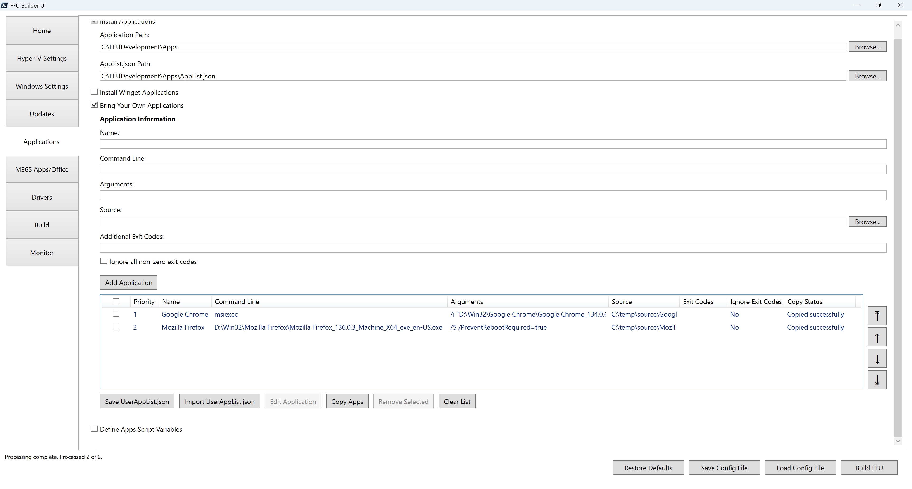

# Bring Your Own Applications



Bring Your Own Applications allows you to run any command line you want in the virtual machine to include in your FFU to install an application, run a script, etc. As the name implies, you'll provide the content, command line, arguments, and additional exit codes.

All applications are stored in the `$AppsPath` parent folder which defaults to `C:\FFUDevelopment\Apps`. Winget source applications and BYO Apps that you select Copy Apps are stored in `$AppsPath\Win32`. MSStore source apps from Winget are stored in `$AppsPath\MSStore`.

At build time, an `Apps.iso` file is created of the `$AppsPath` folder. This ISO gets mounted to the VM. It shows up in the VM as the `D:\` drive. When creating your command line or arguments, you must make sure to reference `D:\`.

## Name

The name of the application. The name is also used when selecting **Copy Apps** to copy apps from a source location to the `$AppsPath\Win32\<Name>` folder (e.g. `C:\FFUDevelopment\Apps\Win32\Google Chrome`)

## Command Line

This is the full path to the command line to install the application, script, or to run a command. If the content was included in the `$AppsPath` this should start with `D:\` (e.g. `D:\Win32\Mozilla Firefox\Mozilla Firefox_136.0.3_Machine_X64_exe_en-US.exe`)

For MSI applications, this should only include msiexec. The rest of the command line will be specified in arguments.

## Arguments

These are the command line arguments for the application. Using the Mozilla Firefox example above, the arguments would be `/S /PreventRebootRequired=true`.

For MSI applications, this will include `/i` and the full-path to the MSI file plus any additional command line parameters (e.g. `/i "D:\Win32\Google Chrome\Google Chrome_134.0.6998.178_Machine_X64_wix_en-US.msi" /quiet /norestart`)

## Source

This is an optional parameter. This is the local source to the content. It is used by the Copy Apps button to copy from the source location to the `$AppsPath\Win32\<Name>` folder. If you don't use the **Copy Apps** button, then you must put the conent in the `$AppsPath` folder manually.

## Additional Exit Codes

This is an optional parameter. Enter a comma-separated list of additional success exit codes if necessary.

## Ignore all non-zero exit codes

If checked, any non-zero exit code will be considered a success.

## Save UserAppList.json

When you're done adding your apps, you must save the `UserAppList.json` file to your `$AppsPath` folder. If you click **Copy Apps**, the `UserAppList.json` file is also saved. The `UserAppList.json` is used by the FFU Builder Orchestrator in the VM to know what to install and when based on the priority of the application.

Below is the `UserAppList.json` of Chrome and Firefox using the example above.

```json
[
  {
    "Priority": 1,
    "Name": "Google Chrome",
    "CommandLine": "msiexec",
    "Arguments": "/i \"D:\\Win32\\Google Chrome\\Google Chrome_134.0.6998.178_Machine_X64_wix_en-US.msi\" /quiet /norestart",
    "Source": "C:\\temp\\source\\Google Chrome",
    "AdditionalExitCodes": "",
    "IgnoreNonZeroExitCodes": false
  },
  {
    "Priority": 2,
    "Name": "Mozilla Firefox",
    "CommandLine": "D:\\Win32\\Mozilla Firefox\\Mozilla Firefox_136.0.3_Machine_X64_exe_en-US.exe",
    "Arguments": "/S /PreventRebootRequired=true",
    "Source": "C:\\temp\\source\\Mozilla Firefox",
    "AdditionalExitCodes": "",
    "IgnoreNonZeroExitCodes": false
  }
]
```

## Import UserAppList.json

You can import a saved `UserAppList.json`

## Edit Application

When you select a single application you can select the **Edit Application** button. This allows you to edit the application information and update the application.

## Copy Apps

If the application source is provided, click **Copy Apps** to copy the application content to the `$AppsPath\Win32` folder (e.g. `C:\FFUDevelopment\Apps\Win32\<Name>`). Network shares are supported. When clicking **Copy Apps** the `UserAppList.json` file is automatically created.

## Remove Selected

Removes the selected applications from the list view. Click **Save UserAppList.json** to save the application list.

## Clear List

The **Clear List** button will clear the list view of what’s currently in it. It will not clear the `UserAppList.json` file if it exists.


