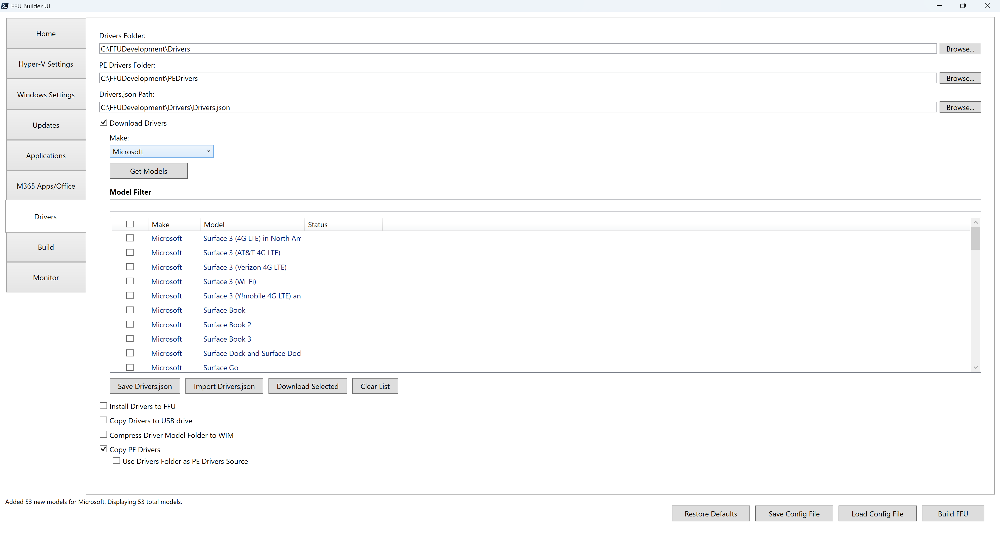
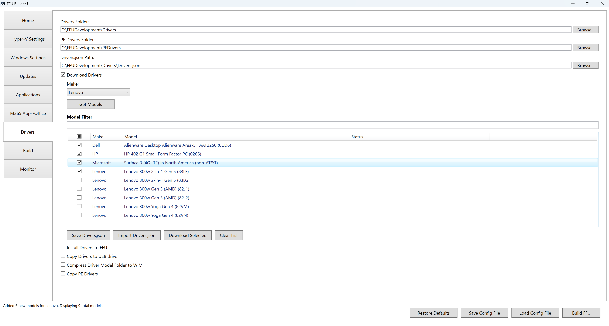

# Drivers



FFU Builder supports adding drivers directly to the FFU file at build time, or adding them as folders on your USB drive which can be serviced offline after the FFU has been applied to your device.

The UI allows you to download the drivers prior to build and/or create a `Drivers.json` file which can be used to automatically download the drivers at build time. This allows for flexibility in downloading drivers whenever you need them. It supports downloading multiple driver models at once in parallel.

## Drivers Folder

This is the location where drivers are downloaded to, or where you'll manually copy drivers to. The default is `.\FFUDevelopment\Drivers`

## PE Drivers Folder

Path to the folder containing drivers to be injected into the WinPE deployment media. Default is `.\FFUDevelopment\PEDrivers`.

## Drivers.json Path

Path to a JSON file that specifies which drivers to download. Default is `.\FFUDevelopment\Drivers\Drivers.json`

## Download Drivers

FFU Builder can download drivers from the following OEMs:

* Dell
* HP
* Lenovo
* Microsoft

Clicking the **Download Drivers** exposes a **Make:** drop down which lists the above four OEMs and a **Get Models** button

Clicking **Get Models** downloads the list of models from the selected OEM.

The **Model Filter** box allows you to type in a string to filter on the model. The filter should match on any portion of text in the model name.

The model column lists the model name and the System ID (for Dell and HP) or the Machine Type (for Lenovo) in parenthesis. The SystemID/Machine Type values are required to know exactly which set of drivers to download for your model. There typically is a lot of overlap, and sometimes the drivers for the various SystemID/MachineTypes for the same model might be exactly the same, it's still best to grab the SystemID/MachineType before downloading drivers.

To get the System ID:

**HP**

* BIOS/UEFI: Either under Main or System Information (it's going to be different depending on the model) you're looking for the **System Board ID** and it should be a four-character code.
* PowerShell:`(Get-CimInstance -Namespace 'root\WMI' -Class MS_SystemInformation).BaseboardProduct`

**Dell**

* BIOS/UEFI: I'm not sure if it's possible to get the System ID from the BIOS/UEFI. I seem to recall in some BIOS screenshots that System SKU is listed in some BIOS/UEFI implementations, but it may not be consistent.
* PowerShell: `(Get-CIMInstance -ClassName "MS_SystemInformation" -NameSpace "root\WMI").SystemSku`

  or

  ```
  [string]$OEMString = Get-WmiObject -Class "Win32_ComputerSystem" | Select-Object -ExpandProperty OEMStringArray
  $ComputerDetails.FallbackSKU = [regex]::Matches($OEMString, '\[\S*]')[0].Value.TrimStart("[").TrimEnd("]")
  ```

**Lenovo**

To find the Machine Type for Lenovo devices, check the bottom/back of the device for the MTM field and capture the first four characters.

* BIOS/UEFI: Look for MTM and grab the first four characters
* PowerShell: `(Get-CIMInstance -ClassName "MS_SystemInformation" -NameSpace "root\WMI").SystemProductName`

You can multi-select different models within the same make, or mix and match different makes. The screenshot below shows different Dell, HP, Lenovo, and Microsoft models selected



## Save Drivers.json

After selecting the drivers you want to download, clicking **Save Drivers.json** will prompt you for a location to save the `Drivers.json` file to. The `Drivers.json` file is responsible for telling `BuildFFUVM.ps1` what drivers to download during the build process.

Below is an example of `Drivers.json`:

```
{
  "HP": {
    "Models": [
      {
        "Name": "HP EliteBook 865 16 inch G11 Notebook PC",
        "SystemId": "8d03"
      }
    ]
  },
  "Dell": {
    "Models": [
      {
        "Name": "Dell Pro Max Desktops Dell Pro Max Micro FCM2250,Dell Pro Max Micro XE FCM2250",
        "CabUrl": "https://downloads.dell.com/FOLDER13898125M/1/Dell_Pro_Max_Desktops_0D14.cab",
        "SystemId": "0D14"
      }
    ]
  },
  "Lenovo": {
    "Models": [
      {
        "Name": "Lenovo 300w Yoga Gen 4",
        "MachineType": "82VN"
      }
    ]
  },
  "Microsoft": {
    "Models": [
      {
        "Name": "Surface Pro for Business (11th Edition)",
        "Link": "https://www.microsoft.com/download/details.aspx?id=108013"
      }
    ]
  }
}
```

## Import Drivers.json

Import Drivers.json allows you to import a previously saved Drivers.json file. The models in the Drivers.json file will show up in the list view pre-selected. This will allow you to select additional models and save an updated version of Drivers.json, or to download the selected models by clicking Download Selected.

## Download Selected

Download Selected will download the selected models to the Drivers Folder path (default .\FFUDevelopment\Drivers). Drivers will download the the .\FFUDevelopment\Drivers\Make\Model folder. Download select also interacts with the Compress Driver Model Folder to WIM checkbox which will download and compress the drivers to WIM.

If you've previously downloaded a driver model and want to compress it to a WIM, you can check he Compress Driver Model Folder to WIM checkbox and click Download Selected again. This will skip the download and compress the driver folder to a WIM file.

Download Selected leverages BITS and the BITS Priority can be controlled by the BITS Priority drop down on the Build tab. If driver downloads via the UI feel slow, change BITS Priority to Foreground to speed them up.

## Clear List

Clears the list view of the previous model list

## Install Drivers to FFU

Install Drivers to FFU will recursively add the drivers in the FFUDevelopment\Drivers folder to the FFU file.

It's recommended to only include a single model's drivers in the FFU. This is because dism will add the drivers to the drivers store in the FFU and any additional models that aren't necessary will bloat the drivers store, using up disk space.

If you're dealing with multiple models, it's recommended to select Copy Drivers to USB drive instead.

## Copy Drivers to USB drive

Copy Drivers to USB drive will copy the drivers to the .\Drivers folder on the deploy partition of the USB drive (e.g. D:\Drivers\Make\Model)

If you're manually copying drivers to the .\FFUDevelopment\Drivers folder, you must copy them to the FFUDevelopment\Drivers\Make\Model folder (e.g. FFUDevelopment\Drivers\Lenovo\Lenovo 300w). Prior releases referenced using just .\FFUDevelopment\Drivers\Model, however for better organization and consistency, the code has been updated to require the make folder.

## Compress Driver Model Folder to WIM

Enabling this checkbox compresses the driver model folder to a WIM file after each model finishes downloading (or when an existing model is detected). Every `Drivers\<Make>\<Model>` directory is captured into a single `<Drivers folder>\<Make>\<Model>.wim` using DISM with `Compress:Max`, which dramatically reduces the space required on your USB drive.

1. Select the models you need, check **Compress Driver Model Folder to WIM**, then click **Download Selected**. Fresh downloads are extracted as usual and immediately compressed into their companion `.wim`.
2. If the model already exists, the download phase is skipped and only the compression runs, so you can rebuild the `.wim` whenever you refresh the folder contents.

By default the extracted folder is deleted after a successful capture so that the `.wim` becomes the canonical artifact. When **Use Drivers Folder as PE Drivers Source** is also checked, the UI keeps the folder in place, writes a `__PreservedForPEDrivers.txt` marker, and lets WinPE driver harvesting reuse the loose INF set.

Additional guidance:

- `DriverMapping.json` is updated to reference the `.wim`, so `Copy Drivers to USB drive`, `BuildFFUVM.ps1 -CopyDrivers`, and the WinPE `ApplyFFU.ps1` flow mount the compressed archive automatically.
- Watch the Drivers tab status column or `FFUDevelopment_UI.log` for DISM progress and troubleshooting details per model.
- Ensure the volume hosting `FFUDevelopment\Drivers` has enough free space for both the source folder and the resulting `.wim`.
- Only applies to drivers from Dell, HP, Lenovo, or Microsoft that are specified in the Drivers.json file. It will not compress models you manually copy to the Drivers folder.

## Copy PE Drivers

When **Copy PE Drivers** is enabled, drivers will be injected into the WinPE deployment media. This ensures that WinPE has the necessary drivers to recognize hardware components like storage controllers, network adapters, and input devices during FFU deployment.

By default, drivers are sourced from the **PE Drivers Folder** (default `.\FFUDevelopment\PEDrivers`). You can manually place drivers in this folder, and they will be injected into the WinPE media during the build process.

### Use Drivers Folder as PE Drivers Source

When **Copy PE Drivers** is checked, an additional sub-option becomes visible:  **Use Drivers Folder as PE Drivers Source** .

When this option is enabled, the script bypasses the PE Drivers Folder and instead dynamically builds the WinPE driver set from the main **Drivers Folder**. The script scans all available drivers in the Drivers folder, parses their INF files, and copies only the essential driver types needed for WinPE, including:

* System devices
* SCSI, RAID, and NVMe controllers
* Keyboards
* Mice and other pointing devices
* Human Interface Devices (HID) for touch support

This eliminates the need to maintain a separate, manually curated `PEDrivers` folder and ensures that WinPE has the necessary drivers based on what you've already downloaded for your target devices.

{: .note-title}

> Note
>
> If the PE Drivers folder already contains content when using this option, it will be cleared before the new driver set is copied in.
>
> Some drivers may fail to be added during injection, which is expected behavior and can be safely ignored.
>
> Network adapters are not included when using the drivers folder as PE drivers source, so if you're using WDS or another network-based solution to copy your FFU and you've modified ApplyFFU.ps1, it's best to not use the **Use Drivers Folder as PE Driver Source** option and just copy in your required PE Drivers to the PE Drivers folder.

## DriverMapping.json

`DriverMapping.json` is an automatically generated file that maps hardware identifiers (like System IDs or Machine Types) to specific driver packages. This file enables the WinPE deployment script (`ApplyFFU.ps1`) to automatically detect your device hardware and apply the correct drivers without manual intervention.

### How it gets created

`DriverMapping.json` is created and updated automatically when you download drivers using the **Download Selected** button on the Drivers tab of the UI, or when drivers are downloaded during the FFU build. Each time you successfully download drivers for a model, the file is updated with the mapping information for that model.

### Automatic Driver Selection During Deployment

When you deploy an FFU using the WinPE media, `ApplyFFU.ps1` looks for `DriverMapping.json` on the USB drive at `D:\Drivers\DriverMapping.json` (where D: is your USB deploy partition). If found, the script:

1. Detects the hardware identifiers of the current device (System ID, Machine Type, etc.)
2. Searches `DriverMapping.json` for a matching entry
3. Automatically selects and applies the correct driver package
4. Falls back to manual driver selection if no match is found

### Required Fields by Manufacturer

Each entry in `DriverMapping.json` contains different required fields depending on the manufacturer:

**All Manufacturers:**

* **Manufacturer** – The OEM name (e.g., "Dell", "HP", "Lenovo", "Microsoft")
* **Model** – The full model name as it appears in the driver download catalog
* **DriverPath** – The relative path to the driver folder or WIM file on the USB drive under the Drivers folder (e.g., "Dell\\\Dell Latitude 7490" or "HP\\\HP EliteBook 865 16 inch G11 Notebook PC.wim").

  Relative paths are used since we don't know the drive letter of the USB drive when the `DriverMapping.json` file is created. And since this uses json, the double backslash is intentional since the first slash is an escape character.

**Dell:**

* **SystemId** – The System SKU identifier (e.g., "0819", "0D14"). This is the primary matching field used during deployment. To find your Dell System SKU via PowerShell, run: `(Get-CIMInstance -ClassName "MS_SystemInformation" -NameSpace "root\WMI").SystemSku`

**HP:**

* **SystemId** – The System Board ID, a four-character code (e.g., "8d03", "83D2"). This is the primary matching field used during deployment. To find your HP System Board ID via PowerShell, run: `(Get-CimInstance -Namespace 'root\WMI' -Class MS_SystemInformation).BaseboardProduct`

**Lenovo:**

* **MachineType** – The first four characters of the MTM (Machine Type Model) field (e.g., "82VN", "21JD"). This is the primary matching field used during deployment. To find your Lenovo Machine Type via PowerShell, run: `(Get-CIMInstance -ClassName "MS_SystemInformation" -NameSpace "root\WMI").SystemProductName`

**Microsoft:**

* No additional fields required beyond Manufacturer, Model, and DriverPath. Matching is performed based on the normalized model name.

### Example DriverMapping.json

Below is an example of `DriverMapping.json` with entries for multiple manufacturers:

```
[
  {
    "Manufacturer": "Dell",
    "Model": "Dell Latitude 7490",
    "DriverPath": "Dell\\Dell Latitude 7490",
    "SystemId": "0819"
  },
  {
    "Manufacturer": "Dell",
    "Model": "Dell Pro Max Desktops Dell Pro Max Micro FCM2250,Dell Pro Max Micro XE FCM2250",
    "DriverPath": "Dell\\Dell Pro Max Desktops Dell Pro Max Micro FCM2250,Dell Pro Max Micro XE FCM2250.wim",
    "SystemId": "0D14"
  },
  {
    "Manufacturer": "HP",
    "Model": "HP EliteBook 865 16 inch G11 Notebook PC",
    "DriverPath": "HP\\HP EliteBook 865 16 inch G11 Notebook PC.wim",
    "SystemId": "8D03"
  },
  {
    "Manufacturer": "Lenovo",
    "Model": "Lenovo 300w Yoga Gen 4",
    "DriverPath": "Lenovo\\Lenovo 300w Yoga Gen 4",
    "MachineType": "82VN"
  },
  {
    "Manufacturer": "Microsoft",
    "Model": "Surface Pro for Business (11th Edition)",
    "DriverPath": "Microsoft\\Surface Pro for Business (11th Edition)"
  }
]
```

## Bring Your Own Drivers

If you manage models that aren't from Dell, HP, Lenovo or Microsoft, or you want to use different drivers from what FFU Builder downloads, you can copy your own drivers to the `.\FFUDevelopment\Drivers` folder using the `.\FFUDevelopment\Drivers\Make\Model` format, or simply change the Drivers Folder path to the location of your drivers content.

You can also manually create your own DriverMapping.json file for the following makes/manufacturers

| Manufacturer                    | Match Field | WMI Class                                   | Property                                        |
| ------------------------------- | ----------- | ------------------------------------------- | ----------------------------------------------- |
| **Dell**                  | SystemId    | `MS_SystemInformation` (via `root\WMI`) | `SystemSku`                                   |
| **Dell** (fallback)       | SystemId    | `Win32_ComputerSystem`                    | `OEMStringArray` (parsed for bracketed value) |
| **HP**                    | SystemId    | `MS_SystemInformation` (via `root\WMI`) | `BaseBoardProduct`                            |
| **Lenovo**                | MachineType | `Win32_ComputerSystem`                    | `Model`                                       |
| **Microsoft**             | Model       | `Win32_ComputerSystem`                    | `Model`                                       |
| **Panasonic Corporation** | SystemId    | `MS_SystemInformation` (via `root\WMI`) | `BaseBoardProduct`                            |
| **Viglen**                | SystemId    | `Win32_BaseBoard`                         | `SKU`                                         |
| **AZW**                   | SystemId    | `MS_SystemInformation` (via `root\WMI`) | `BaseBoardProduct`                            |
| **Fujitsu**               | SystemId    | `Win32_BaseBoard`                         | `SKU`                                         |
| **Getac**                 | SystemId    | `MS_SystemInformation` (via `root\WMI`) | `BaseBoardProduct`                            |
| **Intel**                 | Model       | `Win32_ComputerSystem`                    | `Model`                                       |
| **ByteSpeed**             | Model       | `Win32_ComputerSystem`                    | `Model`                                       |
| **Other** (default)       | Model       | `Win32_ComputerSystem`                    | `Model`                                       |

**Notes:**

* Match Field is the name of the field in the `DriverMapping.json` file (e.g. SystemID, MachineType, Model)
* SystemId is a catch-all term for a unique identifier, however each manufacturer calls this something different and stores them in different places within WMI
* The Dell (fallback) is used for models where the systemSKU isn't available and the OEMStringArray is parsed via Win32_ComputerSystem
* The `MS_SystemInformation` class is queried from the `root\WMI` namespace
* Unless noted, the other WMI classes use the `root\cimv2` namespace
* All identifiers are normalized to uppercase for matching
* ByteSpeed systems with "NUC" in the model name are re-mapped to Intel and use `BaseBoardProduct` instead
* For manufacturers that aren't listed, the default behavior is to use the `Win32_ComputerSystem` `model` string

Below is an example `DriverMapping.json` that includes the additional manufacturers. Note that the model and systemID information is made up and is used only as an example to show how to format the file. You'll need to collect the model or system ID from the locations in the table above and include it in your custom `DriverMapping.json` file. Each entry includes both a WIM and drivers folder for each manufacturer. If you want to include driver WIM files for manufacturers other than Dell, HP, Lenovo, or Microsoft, you'll need to manually compress the drivers folder to a WIM file.

```
[
    {
        "Manufacturer": "Panasonic",
        "Model": "Toughbook CF-33",
        "SystemId": "CF-33LEHAGT1",
        "DriverPath": "Panasonic\\CF-33.wim"
    },
    {
        "Manufacturer": "Panasonic",
        "Model": "Toughbook FZ-55",
        "SystemId": "FZ-55DZ0KVM",
        "DriverPath": "Panasonic\\FZ-55"
    },
    {
        "Manufacturer": "Viglen",
        "Model": "Genie Desktop Pro",
        "SystemId": "VGN-GDP-2024",
        "DriverPath": "Viglen\\GeniePro"
    },
    {
        "Manufacturer": "Viglen",
        "Model": "Omnino Mini",
        "SystemId": "VGN-OMN-M1",
        "DriverPath": "Viglen\\OmninoMini.wim"
    },
    {
        "Manufacturer": "AZW",
        "Model": "SER5 Pro",
        "SystemId": "SER5-5800H",
        "DriverPath": "AZW\\SER5Pro.wim"
    },
    {
        "Manufacturer": "AZW",
        "Model": "U59 Mini PC",
        "SystemId": "U59-N5095",
        "DriverPath": "AZW\\U59"
    },
    {
        "Manufacturer": "Fujitsu",
        "Model": "LIFEBOOK U9312",
        "SystemId": "FPCM52921",
        "DriverPath": "Fujitsu\\LIFEBOOK-U9312"
    },
    {
        "Manufacturer": "Fujitsu",
        "Model": "ESPRIMO D7010",
        "SystemId": "D3644-A1",
        "DriverPath": "Fujitsu\\D7010.wim"
    },
    {
        "Manufacturer": "Getac",
        "Model": "F110 G6",
        "SystemId": "F110G6",
        "DriverPath": "Getac\\F110G6.wim"
    },
    {
        "Manufacturer": "Getac",
        "Model": "B360 Pro",
        "SystemId": "B360PRO",
        "DriverPath": "Getac\\B360Pro"
    },
    {
        "Manufacturer": "Intel",
        "Model": "NUC13ANHi7",
        "DriverPath": "Intel\\NUC13"
    },
    {
        "Manufacturer": "Intel",
        "Model": "NUC12WSHi5",
        "DriverPath": "Intel\\NUC12.wim"
    },
    {
        "Manufacturer": "ByteSpeed",
        "Model": "Tera 2450",
        "DriverPath": "ByteSpeed\\Tera2450.wim"
    },
    {
        "Manufacturer": "ByteSpeed",
        "Model": "Celeritas X1",
        "DriverPath": "ByteSpeed\\CeleritasX1"
    },
    {
        "Manufacturer": "Acer",
        "Model": "TravelMate P214-53",
        "DriverPath": "Acer\\TMP214"
    },
    {
        "Manufacturer": "ASUS",
        "Model": "ExpertBook B5402CVA",
        "DriverPath": "ASUS\\B5402.wim"
    }
]
```


