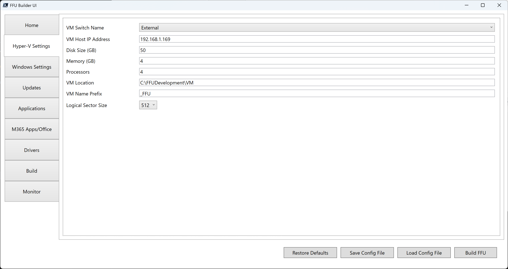

# Hyper-V Settings

## VM Switch Name

Drop down of detected VM Switches. There's also an **Other** option which allows you to specify a VM Switch Name. The other option is useful in scenarios where the machine you're running the UI from isn't going to be the machine where you plan to build the FFU from.

## VM Host IP Address

IP address of the selected Hyper-V switch that will be used for FFU capture. The UI will auto-detected this based on the VM Switch that was selected.

If `$InstallApps` is set to `$true`, this parameter must be configured.

## Disk Size (GB)

Size of the virtual hard disk for the virtual machine. Default is a 50GB dynamic disk. You may want to increase the size if you're installing many apps.

## Memory (GB)

Amount of memory to allocate for the virtual machine. Recommended to use 8GB if possible, especially for Windows 11. Default is 4GB.

## Processors

Number of virtual processors for the virtual machine. Recommended to use at least 4. Default is 4.

## VM Location

Default is `$FFUDevelopmentPath\VM`. This is the location of the VHDX that gets created where Windows will be installed to.

## VM Name Prefix

Prefix for the generated VM. Default is _FFU.

## Logical Sector Size

Uint32 value of 512 or 4096. Useful for 4Kn drives or devices shipping with UFS drives. Default is 512.

There is some error-handling in the script that will call out mismatch issues with logical sector size. Unfortunately you will need to create a new FFU with the correct logical sector size as you can't convert a previously created FFU. Most should be fine with 512, but lower-end devices that used to ship with eMMC drives have now shifted to using UFS.


