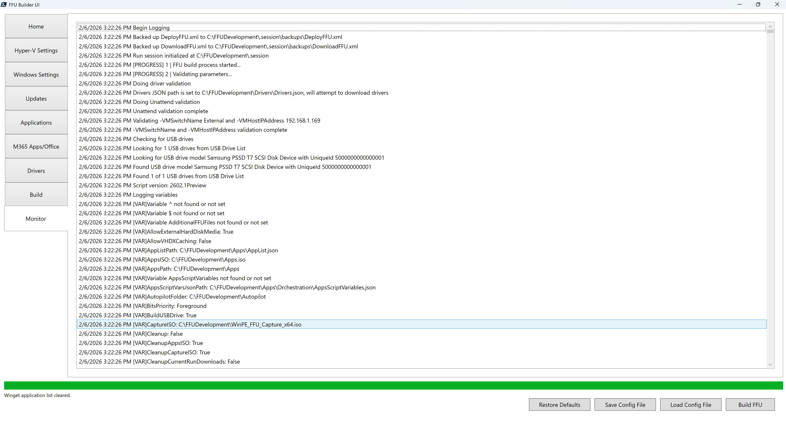

# Monitor

The monitor tab parses the `.\FFUDevelopment\FFUDevelopment.log` file. This makes it easy to track what's happening during the FFU build process.

You can click into the monitor and select one or multiple lines (either single click, or shift+click). Doing so will prevent the log file from continuous scrolling, allowing you time to read what has transpired up to that point.

You can also copy your selection using ctrl+C. This makes it easy to copy and paste parts of the log file used for troubleshooting. 


