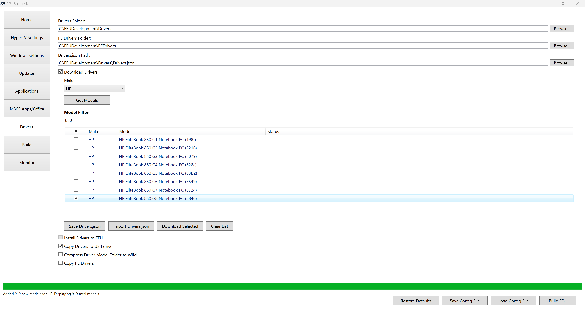
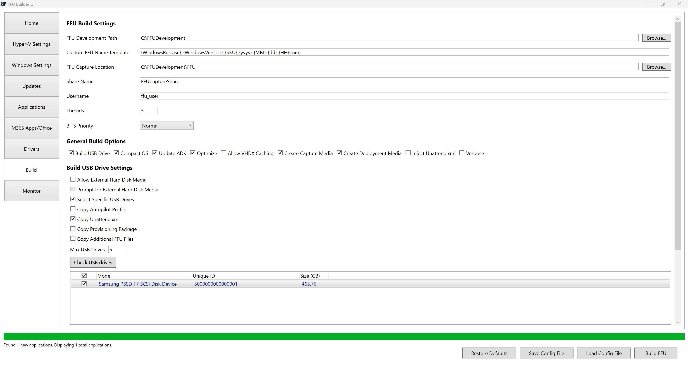
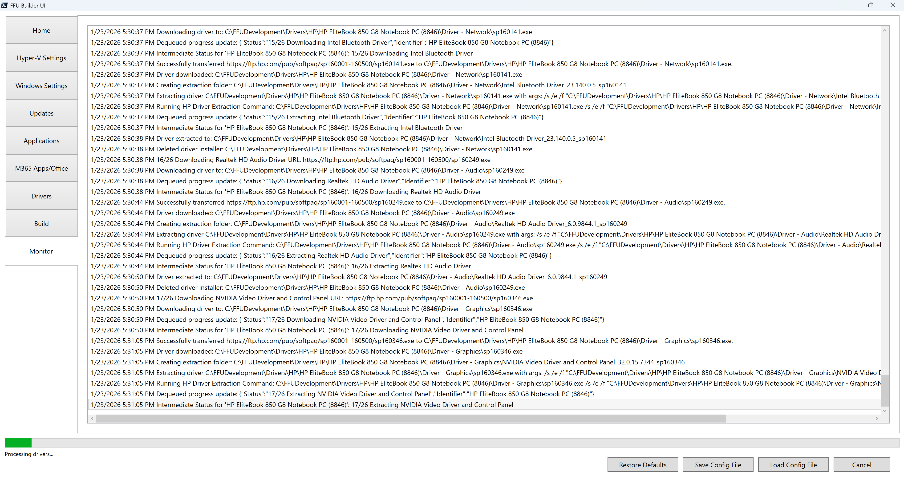
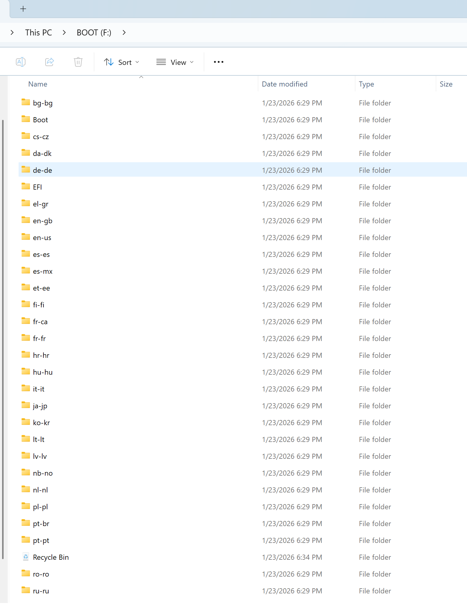
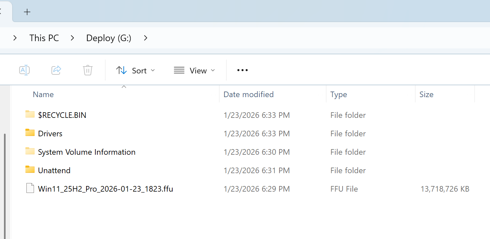
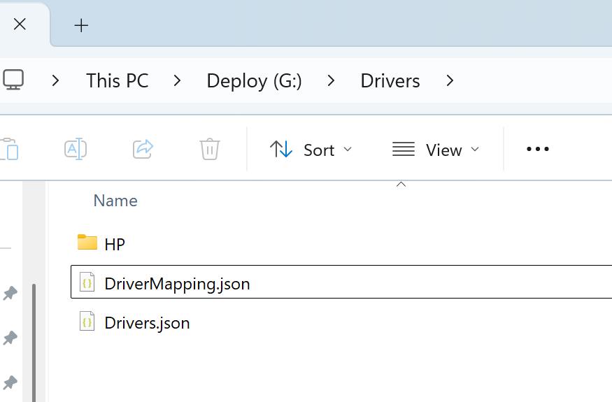
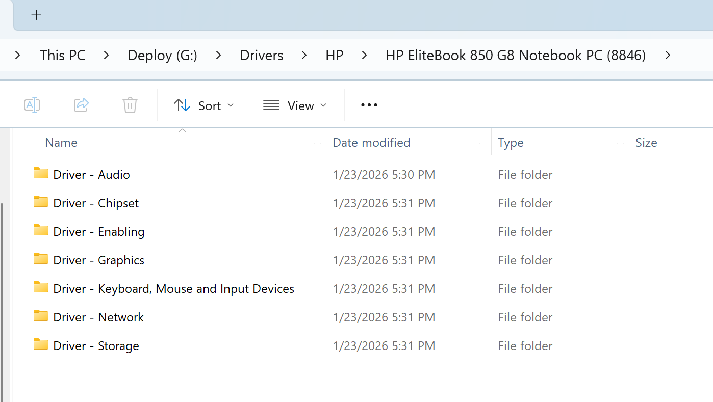

# Quick Start

This is the quick start guide to getting started with FFU Builder. If you're new, start here to build your first FFU.

After following this guide, you will have a USB drive with an FFU that contains the following:

* Windows 11 25H2 (with your choice of architecture, language, SKU, and media type)
* The latest
  * Windows and .NET Cumulative Updates
  * Defender definitions, platform updates, and Windows Security Center application update
  * Microsoft Edge
  * Microsoft OneDrive
  * Malicious Software Removal Tool (MSRT)
  * Microsoft 365 Apps (Current Channel)
* Winget Applications (Optional)
  * Company Portal
* Drivers (Optional)
  * In some cases drivers aren't necessary and you can get away with Windows Update providing drivers. We'll go over how to add drivers via the UI for Microsoft, HP, Lenovo, or Dell devices

## Prerequisites

Follow the [prerequisites](/FFU/prerequisites.html) documentation before getting started.

## Hyper-V Settings

Click the Hyper-V Settings tab

You should be able to keep these settings at the defaults. For VM Switch Name and VM Host IP Address, you'll want to make sure the switch you created in the prerequisites section is listed. FFU Builder should automatically figure out the IP address of the swtich for you.

One setting you might need to set is the Logical Sector Size. 512 is the default and that's what most physical disks use today. However 4kn drives and UFS drives use 4k sector sizes, which would require you to select 4096. For now, select 512. If you have issues during deployment, there is error logging that will tell you if you need to set to 4096 on your device.

## Windows Settings

Click the Windows Settings tab

If you keep ISO Path blank, FFU Builder will download the ESD file that the Windows Media Creation Tool uses. Most people should leave this blank since the Media Creation Tool media ESD file is now kept up to date as of Windows 11 25H2 (it's usually updated 2-3 days after patch Tuesday). This reduces the need to service the media and saves time and disk space.

Change the Windows language to the one of your choosing.

Change the Windows SKU to either Home or Pro depending on what your physical device(s) shipped with. This is due to how activation works by Windows. If you match the media type and SKU with what the device shipped with, then Windows will activate using the key in the firmware. In most scenarios, selecting Pro and Consumer will be what you want.

Leave the other settings as is. There should be no need to provide a product key unless you're providing your own Windows ISO.

## Updates

Keep the defaults

## Applications (optional)

Click the Applications tab

In this quick start we'll be installing the winget published version of the Company Portal application. This is optional, but it's a common application that IT admins like to install that use Intune to manage their devices. If you want to use something else, feel free to replace Company Portal with another app.

You can also provide your own applications instead of, or in conjunction with, winget applications, however this guide will keep things simple and opt for using winget.

Check Install Winget Applications

Click Check Winget Status

In the Winget Search box search for Company Portal

If you see multiple applications, select the msstore source version of the Company Portal application (FFU Builder doesn't allow the winget source application to install due to how the application is packaged). Make sure to click the check box.

Click the Save AppList.json button

This will save an AppList.json file in your C:\FFUDevelopment\Apps folder and should look like this:

```json
{
  "apps": [
    {
      "name": "Company Portal",
      "id": "9WZDNCRFJ3PZ",
      "source": "msstore",
      "architecture": "NA",
      "AdditionalExitCodes": "",
      "IgnoreNonZeroExitCodes": false
    }
  ]
}
```

{: .note-title}

> Note
>
> The AppList.json file is what controls winget application downloads during the FFU build process. You might also notice that you can download the application by clicking the Download Selected button. That will do a point in time download of the selected applications via winget and will also update the AppList.json file. At build time the BuildFFUVM.ps1 script will check the AppList.json file and will check if the apps exist. If they do, it will skip downloading the applications.

{: .note-title}

> Note
>
> If your build machine isn't joined to Microsoft Entra, it will prompt you to authenticate twice to download any msstore source application. First for the application, and the second for the license file. This happens for each msstore source application. If this becomes annoying, you can run the FFUBuilder UI on an Entra joined machine (or hybrid joined) and download the apps you need and copy the Apps folder into the Apps folder on your build machine.

{: .tip-title}

> Tip
>
> To download winget applications with the msstore source, [you need one of the following rights on your account: Global Administrator, User Administrator, or License Administrator](https://learn.microsoft.com/en-us/windows/package-manager/winget/download#:~:text=The%20EntraID%20account%20used%20for%20authentication%20to%20generate%20and%20retrieve%20a%20Microsoft%20Store%20packaged%20app%20license%20file%20must%20be%20a%20member%20of%20one%20of%20the%20following%20three%20Azure%20roles%3A%20Global%20Administrator%2C%20User%20Administrator%2C%20or%20License%20Administrator.)

## M365 Apps/Office

FFU Builder uses the Office Deployment Tool to download and install Microsoft 365 Apps.

The default configuration will install the 64-bit current channel version of Office with Word, Excel, Powerpoint. It will download the currently installed language of the operating system (i.e. uses MatchOS for language), which is fine for most people, however if you need to specify the correct language, you'll need to make some modifications to the XML files.

Check the [M365 Apps/Office UI Overview page](/FFU/M365appsoffice.html) that explains the XMLs used in detail.

## Drivers

FFU Builder makes it easy to add drivers from the four major OEMs (Dell, HP, Lenovo, Microsoft). The difference between FFU Builder and other solutions is that FFU Builder tries to use the latest drivers from the OEM, not out-dated driver packages/CABs. This makes things somewhat more complicated to develop, but should make for a better experience where you have the most secure, up to date set of drivers available. It won't handle firmware/BIOS updates as Windows doesn't allow for servicing those types of updates.

**Bring Your Own Drivers**

You're also free to bring your own drivers instead of relying on using the drivers provided by FFU Builder. If you prefer the OEM cabs, you can download them and copy them to the `C:\FFUDevelopment\Drivers\<Make>\<Model>` folder where make is the name of the OEM and Model is the name of the model.

**WinPE Drivers**

FFU Builder also supports adding PE drivers. You can either copy your PE Drivers to the `C:\FFUDevelopment\PEDrivers` folder, or use the Drivers Folder as the PE drivers source. If you use the Drivers folder as the PE drivers source, the build script will find the appropriate driver class GUIDs for WinPE from the `C:\FFUDevelopment\Drivers` folder and copy them into the `C:\FFUDevelopment\PEDrivers` folder, overwriting what's currently in the PEDrivers folder.

For the purposes of this quick start, we'll use an HP EliteBook 850 G8 as the example model.

Click the Drivers tab and click the Download Drivers checkbox.

In the Make drop down, select HP and click Get Models. This may take 10-30 seconds to download the HP PlatformList.cab file and parse it. Once the file has been downloaded and parsed, the model listview will be populated with all of the HP models. Dell has a similar experience with downloading and parsing its Catalog XML file. Microsoft parses some webpages to generate a SurfaceDriverIndex.json

In the Model Filter text box, enter 850. This will filter down to all models that contain 850 in the model name. The model name column will list the model name and the system ID in parenthesis. The system ID is important because it's that value that is used at deployment time to automatically select which drivers to install if you've chosen to copy drivers to the USB drive instead of including them in the FFU file.

Select **HP EliteBook 850 G8 Notebook PC (8846)**

{: .tip-title}

> Tip
>
> If you need to manage multiple models, it's best to select **Copy Drivers to USB drive.** This will keep the FFU file small and allow FFU Builder to automatically select the right drivers at deployment time (based on the system information queried via WMI).
>
> If you select Install Drivers to FFU, you bloat the driver store with drivers you don't need, creating a larger FFU file and wasting disk space on the physical device. It's best to use this option when building an FFU for a single model.

To find the SystemID for HP, you can check BIOS/UEFI, or you can use PowerShell:

```powershell
(Get-CimInstance -Namespace 'root\WMI' -Class MS_SystemInformation).BaseboardProduct
```

Check **Copy Drivers to USB drive** (even though we're doing a single model in this quick start, most people will likely be managing many different models. The expectation is that most should be using **Copy Drivers to USB drive** in their workflows)

Your view should look like this:



At this point, you can either Save the Drivers.json file or click Download Selected. Clicking Save Drivers.json will save the Driver model information to the Drivers.json file which will be used at build time to download the drivers. Clicking Download Selected will download the drivers right now. This can be useful for testing without having to go through an entire build, or good for airgapped environments where you can download what you need from the internet on one network, and bring that over to the airgapped network.

For this quick start, click **Save Drivers.json** and save the file to the `C:\FFUDevelopment\Drivers` folder.

## Build

Click the Build tab

On the Build tab, click **Build USB Drive.**

Depending on your USB drive, it might be a removable drive or external hard disk media. If you're using a fast USB SSD, it's likely that Windows treats that drive as an external hard disk. If that's the case, you might need to click **Allow External Hard Disk Media.** If you do, you may also want to uncheck **Prompt for External Hard Disk Media.** This option is in place to prevent external hard disks from automatically being formatted when building the USB drive. If you don't have any external hard disks connected to your build machine, then it's safe to uncheck the **Prompt for External Hard Disk Media** option.

Another safety measure is **Select Specific USB Drives**. When you check **Select Specific USB Drives** a list view will pop up with a **Check USB drives** button. Clicking the **Check USB Drives** button will show all connected USB drives (removable or external hard disks). Select which drives you want.

**Device Naming**

Device naming can be done from PE. The way this works is by leveraging an unattend.xml file to either take input from the user at imaging time or read a list of prefix values and append the serial number of the device. There are some major benefits to doing this:

1. Total deployment time is reduced if naming is set at FFU deployment time since there is no additional reboot done during OOBE.
2. Reduces the need for multiple provisioning packages or autopilot profiles. This means you can use a single PPKG or autopilot profile.

**Prompt for Device Name**

If you want to be prompted for the device name, simply check **Copy Unattend.xml.** This tells the build script to copy the appropriate architecture unattend_arch.xml file from the `C:\FFUDevelopment\Unattend` folder to the `.\unattend` folder on the deploy partition of the USB drive.

**Specifying Multiple Name Prefixes**

If you have multiple device name prefixes for different locations or device use cases, or even a single prefix, you can specify a prefixes.txt file in the `C:\FFUDevelopment\unattend` folder. If the prefixes.txt file is detected and a single prefix is listed, the device will just use that prefix and append the serial number of the device. If there are multiple prefixes listed in the prefixes.txt file, you will be prompted to select which prefix you want to name the device and the serial number will be appended to that prefix. If you want a dash in the name, include the dash in the prefix (e.g. if ABCD- is in the prefixes.txt file, the device name will be ABCD-SerialNumber).

{: .warning-title}

> Warning
>
> If using a provisioning package or autopilot json file, DO NOT specify a name in either of these. They will overwrite the name you have specified in the unattend.xml.

**Post Build Cleanup**

Leave the Post Build Cleanup section at the defaults

Your Build tab should look something like this:



Click **Build FFU**

Depending on your internet speed, speed of your build machine, etc. this will take some time (probably at least 20 minutes). After clicking Build FFU, you'll be automatically moved to the Monitor tab.

## Monitor



The monitor tab parses the `C:\FFUDevelopment\FFUDevelopment.log` file. If you'd like to use CMTrace or another tool to monitor the log, feel free. The monitor tab has some similar functionality to CMTrace. If you click off the last line of the log in the monitor tab it will stay on that line, allowing you to read what you have selected instead of the log autoscrolling. You can also copy one or multiple lines by selecting a line and shift+clicking the last line you want to select and hitting ctrl+c to copy the lines.

Now sit back, relax, and watch FFU Builder do its magic. You should see a VM pop up after everything is downloaded and Windows has been installed to the VHDX file (it may not if Hyper-V manager wasn't previously open). If you don't see a VM pop up, you can open up Hyper-V manager and look for a VM with a name that starts with **_FFU-.**

{: .note-title}

> Note
>
> Don't interact with the VM (e.g. don't click into the PowerShell window that's orchestrating the install of the updates, apps, etc). The whole process should be completly automated with no user interaction necessary. If you click into the PowerShell window while it's working, you may get PowerShell into "select" mode. If this happens, the PowerShell window will look like it's "stuck." That's because clicking into a cmd/PowerShell window while something is in process and you're in select mode waits for you to exit select by hitting Enter. 

## Post Build

Once the build is complete, you should have a USB drive with two partitions: Boot and Deploy.

The Boot partition is the WinPE Deployment media. It'll look like this:



The Deploy partition is where the FFU file, the Drivers folder, and Unattend folders should be.



The Drivers folder will have an HP folder, a DriverMapping.json and Drivers.json file.



The DriverMapping.json file is what's used to do automatic driver matching during deployment. FFU Builder will read this file and match on the SystemID to know which driver folder to apply. Since there's only a single driver folder in this example, the file is fairly simple to understand. When you have multiple models and OEMs, the file gets a bit more complex.

The DriverMapping.json should look like this:

```json
{
  "Manufacturer": "HP",
  "Model": "HP EliteBook 850 G8 Notebook PC (8846)",
  "DriverPath": "HP\\HP EliteBook 850 G8 Notebook PC (8846)",
  "SystemId": "8846"
}
```

The HP EliteBook 850 driver folder should be populated with the various driver categories:



And the Unattend folder should have an unattend.xml file with the following content:

```xml
<?xml version="1.0" encoding="utf-8"?>
<unattend xmlns="urn:schemas-microsoft-com:unattend">
  <settings pass="specialize">
  <!--<ComputerName> must be in the first Component Element  "Microsoft-Windows-Shell-Setup" . Do not change the order or remove it -->
    <component name="Microsoft-Windows-Shell-Setup" processorArchitecture="amd64" publicKeyToken="31bf3856ad364e35" language="neutral" versionScope="nonSxS" xmlns:wcm="http://schemas.microsoft.com/WMIConfig/2002/State" xmlns:xsi="http://www.w3.org/2001/XMLSchema-instance">
      <ComputerName>MyComputer</ComputerName>
    </component>
  <!--Place addtional Components Elements and settings below here. -->
  </settings>
</unattend>
```

Now you're ready to deploy the FFU to your device. 

## Deployment

Deployment should be fairly straight forward: boot off the USB device, get prompted for a device name, and the deployment of the FFU and drivers should happen automatically. 

If you have any questions or run into any issues, [open a discussion in the Github repo](https://github.com/rbalsleyMSFT/FFU/discussions).


