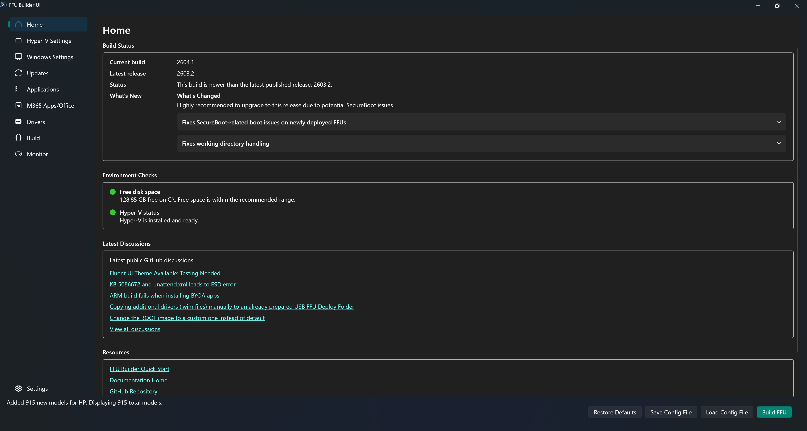

# UI Overview

The user interface has 9 distinct pages for easy navigation.

## Dialogs

FFU Builder's confirmation, information, warning, error, and text-entry dialogs use the same Fluent styling as the main window. They follow the selected light, dark, or system theme, including the Winget update selection and completion dialogs.

Dialogs stay centered over their parent window and keep it inactive until you respond. Long messages can be scrolled, and **Ctrl+C** copies a message dialog's text. **Esc** cancels when cancellation is available; a **Yes/No** confirmation requires an explicit choice.

File and folder pickers and Windows UAC prompts are Windows system dialogs and retain the appearance provided by Windows.

If a themed dialog can't be displayed, FFU Builder shows the same message in a standard Windows dialog instead and records the reason in the UI log.
