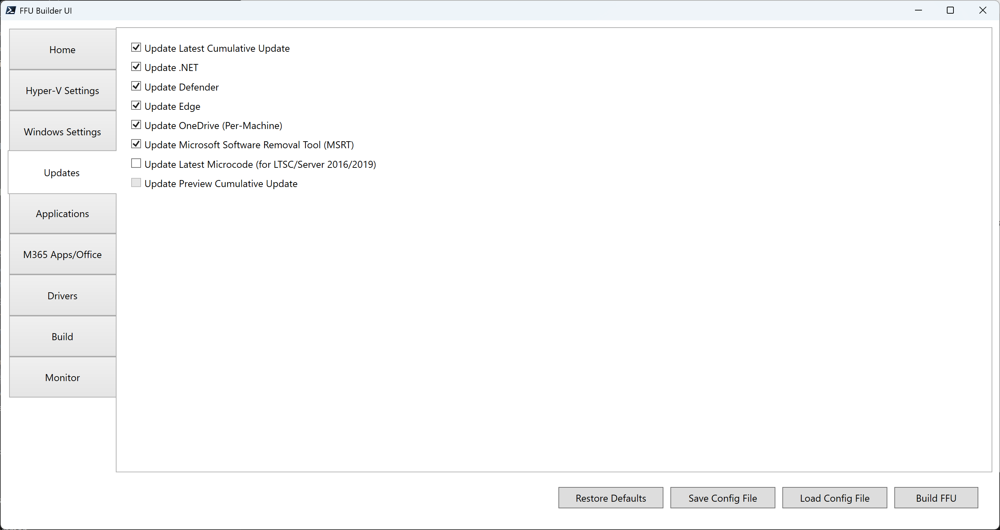

# Updates

## Update Latest Cumulative Update

Controls the `-UpdateLatestCU` parameter. When set to `$true`, will download and install the latest cumulative update for Windows.

## Update .NET

Controls the `-UpdateLatestNet` parameter. When set to `$true`, will download and install the latest .NET framework update for Windows.

## Update Defender

Controls the `-UpdateLatestDefender` parameter. When set to `$true`, will download and install the latest Windows Defender definitions, Defender platform, and Windows Security app update.

## Update Edge

Controls the `-UpdateEdge` parameter. When set to `$true`, will download and install the latest Microsoft Edge browser.

## Update OneDrive (per-machine)

Controls the `-UpdateOneDrive` parameter. When set to `$true`, will download and install the latest OneDrive and install it as per-machine instead of per-user.

## Update Microsoft Software Removal Tool (MSRT)

Controls the `-UpdateLatestMSRT` parameter. When set to `$true`, will download and install the latest Windows Malicious Software Removal Tool.

## Update Latest Microcode (for LTSC/Server 2016/2019)

Controls the `-UpdateLatestMicrocode` parameter. When set to `$true`, will download and install the latest microcode updates for applicable Windows releases (e.g., Windows Server 2016/2019, Windows 10 LTSC 2016/2019) into the FFU.

## Update Preview Cumulative Update

Controls the `-UpdatePreviewCU` parameter. When set to `$true`, will download and install the latest preview cumulative update for Windows.

{: .note-title}

> Note
>
> The UI will only allow one of **Update Latest CU** or **Update Preview CU** to be checked to prevent both being applied. 


