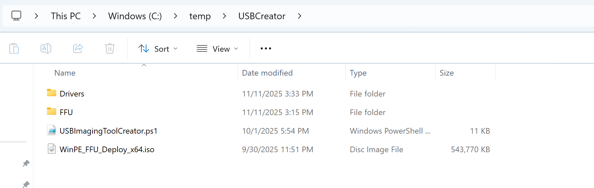

# USB Imaging Tool Creator

`USBImagingToolCreator.ps1` is a standalone helper for creating one or more deployment USB drives from a deploy ISO, FFU files, and optional drivers. This is best used when you want to provide remote technicians the FFU file(s) you've built and optionally a drivers folder that contains the drivers for the models they will need to manage. They can also provide their own drivers (using Drivers\Make\Model format (e.g Drivers\Dell\Optiplex 7060 (085D))

## How the script works

- `-DeployISOPath` is required and should point to the deploy ISO file.
- The script uses the parent folder of that ISO as its working root.
- FFU files are copied from `<ISO parent>\FFU` (all `.ffu` files, recursive).
- Drivers are copied from `<ISO parent>\Drivers` (recursive) when present.
- If drivers are not found, the script creates an empty `Drivers` folder on each deploy partition.
- `-DisableAutoPlay` is optional and temporarily disables AutoPlay for the current user during media creation. This is useful in situations where you see File Explorer pop ups as it's building the USB drive.

## Network share workflow (admin/technician)

For a shared workflow, stage one folder on a share with the deploy ISO and content that technicians should copy to USB drives.

If you do not already have a deployment ISO in the staging location, create one first using [Create PE Media](/create_pemedia.html). This lets admins quickly generate the deploy ISO and then stage it for technicians using `USBImagingToolCreator.ps1`.

Example layout:

```text
\\Server\FFUStaging\
  WinPE_FFU_Deploy.iso
  FFU\
    <image files>.ffu
  Drivers\
    <optional driver content>
```

Run from an elevated PowerShell session:

```powershell
.\USBImagingToolCreator.ps1 -DeployISOPath "\\Server\FFUStaging\WinPE_FFU_Deploy.iso" -DisableAutoPlay
```

The script passes `-DeployISOPath` directly to `Mount-DiskImage`, so use a path the local Windows host can mount.

## Example folder structure

In this example a folder named USBCreator was made and the Drivers and FFU folders as well as the WinPE_FFU_Deploy_x64.iso and USBImagingToolCreator.ps1 files were copied from the FFUDevelopment folder to this new folder.



## What happens when you run it

1. Detects disks with media type **Removable media** or **External hard disk media**.
2. Prompts for a single drive selection or an all-drives selection.
3. Stops `mmc` and `diskpart` processes to reduce drive lock issues.
4. Erases each selected disk and rebuilds it as MBR with:
   - `Boot` partition (2 GB, FAT32, active)
   - `Deploy` partition (remaining space, NTFS)
5. Mounts the deploy ISO and copies all ISO content to every `Boot` partition.
6. Copies FFU content to every `Deploy` partition.
7. Copies driver content into `Deploy\Drivers` (or creates an empty `Drivers` folder).
8. Dismounts the ISO and reports completion.

{: .warning-title}

> Warning
>
> Selected disks are fully erased (`Clear-Disk -RemoveData -RemoveOEM`), so verify drive selection carefully, especially when using the all-drives option.

## Logging and progress

- Progress is shown in the PowerShell progress UI.
- `Script.log` is written in the same folder as the deploy ISO (the working root folder).


