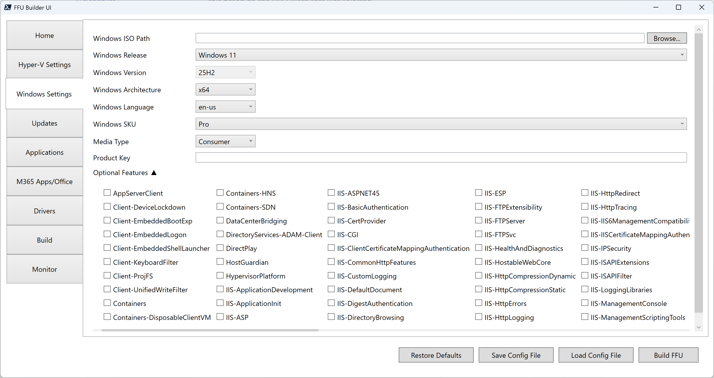

# Windows Settings

## Windows ISO Path

Path to Windows 10/11 ISO file. If left blank, FFU Builder will download the latest version of Windows 10 or 11 from the Media Creation Tool.

{: .tip-title}

> Tip
>
> Should I provide my own ISO, or let FFU Builder download the media
>
> It's recommended to use the latest updated ISO from Visual Studio Downloads, or the Media Creation tool. See the Media Type section below for a better understanding of business and consumer media and how it impacts Subscription Activation.

## Windows Release

Integer value of 10 or 11. This is used to identify which release of Windows to download. Default is 11.

## Windows Version

String value of the Windows version. Default is `25H2`. If an ISO is not specified, this drop down is disabled. If an ISO is specified, you can select from the drop down which version of Windows you're installing. The Windows version is used in quite a few different scenarios (HP driver downloads, VHDXCaching, MCT media downloads, FFU file naming, and cumulative update downloads), so it's important you specify the correct Windows Version.

## Windows Architecture

String value of `x86`, `x64`, or `arm64`. Depending on the Windows release and Windows version, the UI will only specify the supported architecture types for a specific Release/Version combo.

## Windows Language

String value in language-region format (e.g., `en-us`). This is used to identify which language of media to download. Default is `en-us`.

{: .note-title}

> Note
>
> These are the supported languages that can be used with the `-WindowsLang` parameter when downloading the Windows MCT\ESD file
>
> ar-sa
> bg-bg
> cs-cz
> da-dk
> de-de
> el-gr
> en-gb
> en-us
> es-es
> es-mx
> et-ee
> fi-fi
> fr-ca
> fr-fr
> he-il
> hr-hr
> hu-hu
> it-it
> ja-jp
> ko-kr
> lt-lt
> lv-lv
> nb-no
> nl-nl
> pl-pl
> pt-br
> pt-pt
> ro-ro
> ru-ru
> sk-sk
> sl-si
> sr-latn-rs
> sv-se
> th-th
> tr-tr
> uk-ua
> zh-cn
> zh-tw

## Windows SKU

Edition of Windows 10/11/LTSC/Server to be installed.

{: .note-title}

> Note
>
> The following SKUs are supported
>
> Home
> Home N
> Home Single Language
> Education
> Education N
> Pro
> Pro N
> Pro Education
> Pro Education N
> Pro for Workstations
> Pro N for Workstations
> Enterprise
> Enterprise N
> Enterprise 2016 LTSB
> Enterprise N 2016 LTSB
> Enterprise LTSC
> Enterprise N LTSC
> IoT Enterprise LTSC
> IoT Enterprise N LTSC
> Standard
> Standard (Desktop Experience)
> Datacenter
> Datacenter (Desktop Experience)

## Media Type

String value of either `business` or `consumer`. This is used to identify which media type to download if not providing an ISO. Default is `consumer`

{: .tip-title}

> Tip
>
> Recommendation on media type to use
>
> Windows media comes in two types: business or consumer.
>
> Windows media can be obtained from a few different sources: Volume Licensing Service Center (VLSC – now available at admin.microsoft.com), Microsoft Visual Studio Downloads, or the Windows Media Creation Tool.
>
> The `BuildFFUVM.ps1` script will allow you to pass whichever type of media you want from whatever source you want using the -ISOPath parameter; however, **it’s recommended that you use consumer media**, not business/VL. This is because Subscription Activation will fail if the media is mismatched from the key in the firmware.
>
> If you plan on using a MAK or KMS to activate, you can use media from VLSC, but if you expect the device to activate automatically and upgrade to Enterprise or Education SKUs via Subscription Activation, you must use consumer media. To use a MAK/KMS key to activate, you must provide the -`ProductKey XXXXX-XXXXX-XXXXX-XXXXX-XXXXX` parameter.

## Product Key

Product key for the Windows edition specified in WindowsSKU. This will overwrite whatever SKU is entered for WindowsSKU. Recommended to use if you want to use a MAK or KMS key to activate Enterprise or Education. If using VL media instead of consumer media, you'll want to enter a MAK or KMS key here.

## Optional Features

A list of optional features that you can enable for the version of Windows you're installing (e.g. netfx3; TFTP). 


