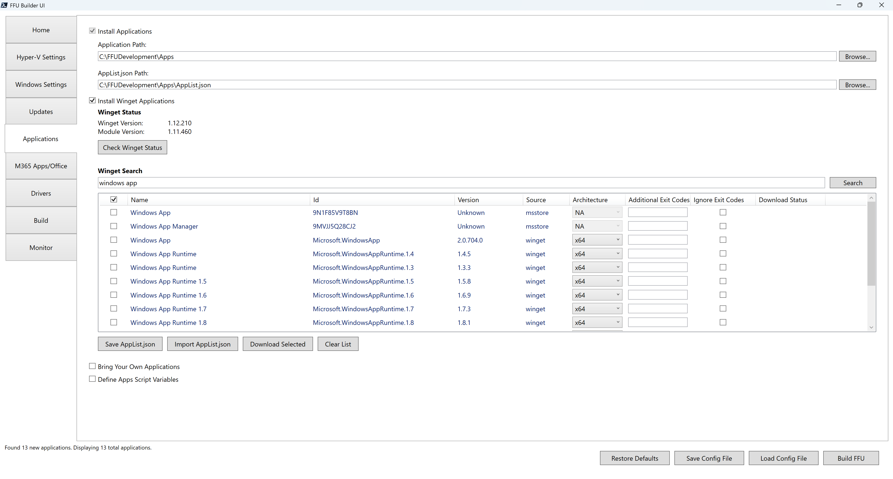
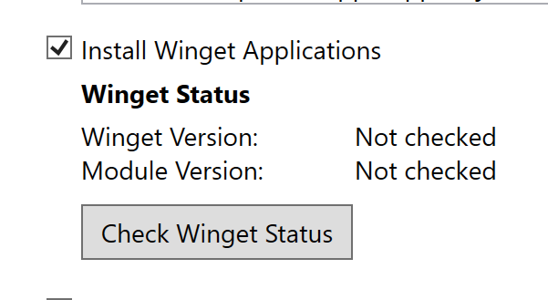
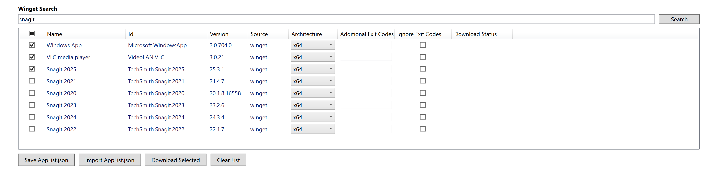
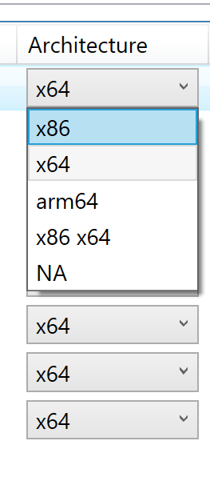

# Install Winget Applications



## Check Winget Status

Installing Winget applications requires that both the winget CLI and Microsoft.Winget.Client PowerShell module to be installed. Minimum required version of both the CLI and PowerShell module is 1.8.1911.

Click **Check Winget Status** to validate the versions of both the CLI and PowerShell module. If older than the minimum required version, will be updated to the latest version.



After validating Winget status, you'll be able to search winget for applications. The larger the result set, the longer it will take for the list view to be populated. For example, if searching for **win**, the UI might appear to hang while it searches for apps with a name or id of **win** due to 669 results being returned and processed. Instead, if you search for **windows app**, 13 results are returned within a few seconds.

The UI allows for multi-selection of applications



You can also change the architecture, add additional exit codes, or ignore exit codes completely.

## Architecture



FFU Builder supports x86, x64, arm64, and x86/x64 (both) for applications in the winget source repository. For apps in the msstore source repository, the architecture cannot be changed. In most cases, x64 will be what you want, however in some cases the combo of x86 and x64 will be necessary. This might be due to runtimes (.NET, Visual C++) where an application is expecting both x86 and x64 runtimes.

## Additional Exit Codes

You can provide a comma separated list of additional exit codes if your application doesn't exit with 0. Some apps may exit with a non-zero exit code.

## Ignore Exit Codes

If you know your application exits with some random exit code or simply don't care to populate a list of approved exit codes, check the box to ignore exit codes and FFU Builder will ignore the exit code and continue on.

## Download Status

FFU Builder allows you to download applications prior to deployment. When clicking the Download Selected button, the Download Status column tracks the status of the download and outputs success, or in the case of an error, the reason why the download may have failed.

## Save AppList.json

FFU Builder leverages a number of json files to tell the `BuildFFUVM.ps1` script what to do during deployment time. `AppList.json` controls the Winget application download and installation.

The `AppList.json` file gets created when clicking **Download Selected**, or clicking the **Save AppList.json** file. The default path for the `AppList.json` file is `$AppsPath\AppList.json`

An example of the `AppList.json` file:

```json
{
  "apps": [
    {
      "name": "Windows App",
      "id": "Microsoft.WindowsApp",
      "source": "winget",
      "architecture": "x64",
      "AdditionalExitCodes": "",
      "IgnoreNonZeroExitCodes": false
    },
    {
      "name": "VLC media player",
      "id": "VideoLAN.VLC",
      "source": "winget",
      "architecture": "x64",
      "AdditionalExitCodes": "",
      "IgnoreNonZeroExitCodes": false
    },
    {
      "name": "Snagit 2025",
      "id": "TechSmith.Snagit.2025",
      "source": "winget",
      "architecture": "x64",
      "AdditionalExitCodes": "",
      "IgnoreNonZeroExitCodes": false
    },
    {
      "name": "Company Portal",
      "id": "9WZDNCRFJ3PZ",
      "source": "msstore",
      "architecture": "NA",
      "AdditionalExitCodes": "",
      "IgnoreNonZeroExitCodes": false
    }
  ]
}
```

## Import AppList.json

If you have a previously saved `AppList.json` you want to use or modify, you can import an `AppList.json` file.

## Download Selected

As mentioned in the Download Selected section above, FFU Builder allows you to download applications prior to deployment. When clicking the Download Selected button, the Download Status column tracks the status of the download and outputs success, or in the case of an error, the reason why the download may have failed. By default it will download five applications at a time. This is controlled by the

Apps are downloaded to `.\FFUDevelopment\Apps\Win32\<AppName>` or `.\FFUDevelopment\Apps\MSStore\<AppName>` depending on the winget source value. Each application will have the app installation files and a yaml manifest file. For Win32 applications, FFU Builder parses the yaml file to grab the silent install switches needed for silent application installation at build time.

{: .tip-title}

> Tip
>
> When downloading msstore source applications, Microsoft requires applications to be downloaded with a license file (the Winget PowerShell module doesn't allow the option to skip downloading the license like the winget CLI does). This requires authentication via Entra ID. If using a device joined to Entra and signed in with your Entra ID, SSO will bypass the need to re-authenticate to download the app and license file. If the machine you are running FFU Builder on is not joined to Entra ID, you will be prompted twice to download the application and the license file.
>
> It's recommended that if you are downloading a lot of msstore source applications, do it from a machine that's joined to Entra ID.

## Clear List

The Clear List button will clear the list view of what's currently in it. It will not clear the AppList.json file if it exists.


