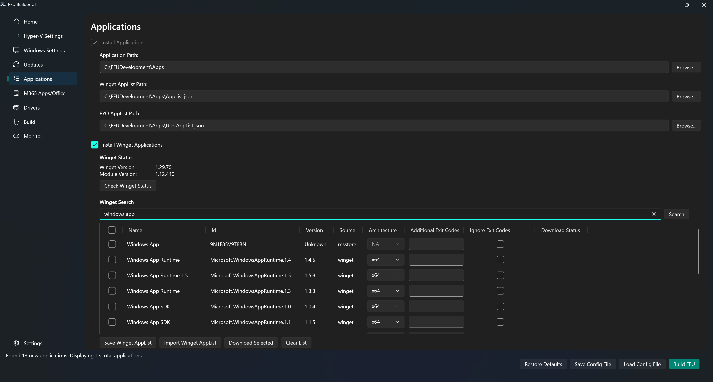
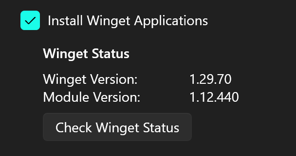
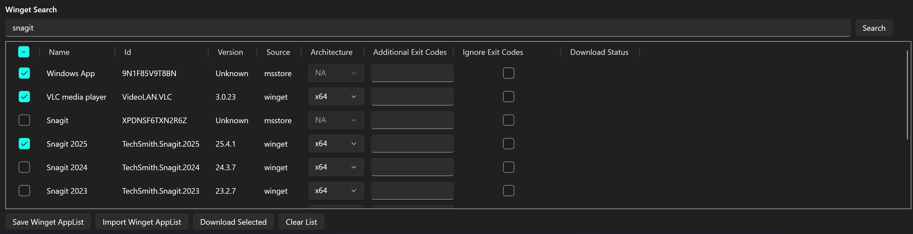
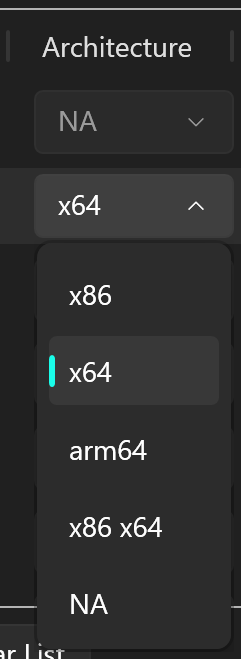

# Install Winget Applications



## Check Winget Status

Installing Winget applications requires both the Winget CLI and the Microsoft.WinGet.Client PowerShell module. Both components must be version **1.8.1911** or later, and the **CLI version must match or exceed the module version**.

Version `1.29.380` introduces an elevated-use compatibility boundary. If either component is version **1.29.380 or later**, both must be **1.29.380 or later**. CLI `1.29.380` with module `1.29.280` is not supported, nor is the reverse pairing. Older pairs can still be used when both meet the minimum and the CLI matches or exceeds the module.

The versions do not have to be identical. The CLI may be newer because App Installer receives updates through the Microsoft Store, but both compatibility rules must still be met. FFU Builder does not downgrade either component to make the versions identical.

Click **Check Winget Status** to check compatibility and look for the latest stable releases. The **Winget CLI Version** and **Module Version** rows show the **Installed** and **Latest stable** versions side by side. This check **does not install or update anything**. It checks GitHub for CLI releases and PSGallery for module releases.

If an update check fails, the status area displays the reason. You can still use a compatible installed pair even when FFU Builder cannot check for newer releases.



### Choose which components to update

An **Update** button appears when an update is available. If only one component has an update, click **Update** to review and confirm that update.

If both components have updates, **Update** opens a dialog showing the installed and proposed versions. Choose one of the following options, then click **Update** in the dialog to confirm. Click **Cancel** to leave both components unchanged.

| Choice                | Behavior                                                                                                                                               |
| --------------------- | ------------------------------------------------------------------------------------------------------------------------------------------------------ |
| **Update both** | Updates both components, starting with the CLI when a usable module is already installed. This is the default choice when both updates are compatible. |
| **CLI only**    | Updates the CLI only when the resulting version pair is compatible, including the`1.29.380` boundary.                                                |
| **Module only** | Updates the module only when the resulting version pair is compatible, including the`1.29.380` boundary.                                             |

Updates are optional when the installed versions are compatible. When moving both components from versions below `1.29.380` to versions at or above it, choose **Update both**. **CLI only** and **Module only** are disabled because either choice would leave an incompatible pair.

If one component has already crossed the boundary, **Check Winget Status** reports that the other component needs updating. For example, with CLI `1.29.380` and module `1.29.280`, **Update** can update just the module to a compatible version. Searching and downloading remain disabled until the installed pair is compatible and any required restart is complete.

Choices that would leave the versions incompatible are disabled with an explanation. The **Update** button is disabled while a WinGet operation is running, a restart is required, or no compatible update choice is available. GitHub and PSGallery releases may not become available at the same time. If a compatible version of the other component is not available, leave that update unselected and check again later.

{: .important-title}

> Important
>
> Updating a module that is already loaded requires a fresh PowerShell process. Save your configuration, close FFU Builder, and restart FFU Builder from a new PowerShell process before searching or downloading applications. Reimporting the module in the same process does not replace native DLLs that are already loaded. FFU Builder does not restart itself or the PowerShell process automatically. 

When both components need updating and no usable module is installed, **Update both** first installs the module needed to repair or install the CLI. If an older module was already loaded, FFU Builder will ask you to restart before completing the CLI update.

FFU Builder checks compatibility again before searching or downloading, including when applications were imported from an existing configuration. If one step of **Update both** fails, the resulting versions are checked again and WinGet operations remain blocked if the pair is incompatible. Update failures are reported instead of being treated as an empty search result.

Microsoft documents the elevated-use requirement for module `1.29.380` and later in [microsoft/winget-cli#6560](https://github.com/microsoft/winget-cli/issues/6560#issuecomment-5798672092). FFU Builder enforces the `1.29.380` boundary in both directions, in addition to the CLI-at-least-module rule.

### Command-line builds

Command-line builds validate the installed versions before downloading Winget applications. They do not prompt for updates, check for optional newer releases, or install missing prerequisites automatically.

If a prerequisite is missing or incompatible, the build stops with the detected versions and corrective guidance. Use **Check Winget Status** in the UI to choose updates, then restart PowerShell if requested and rerun the build.

If a compatible module is already installed, you can also update the CLI from an elevated PowerShell 7 session. Use **Update both** in FFU Builder when crossing the `1.29.380` boundary with both components:

```powershell
Import-Module Microsoft.WinGet.Client -ErrorAction Stop
Repair-WinGetPackageManager -Latest -ErrorAction Stop
winget --version
```

See the [Repair-WinGetPackageManager reference](https://github.com/microsoft/winget-cli/blob/master/src/PowerShell/Help/Microsoft.WinGet.Client/Repair-WinGetPackageManager.md) for available options. Before updating either component manually, make sure the resulting pair meets both compatibility rules above. After changing a module that was already loaded, start a new PowerShell process.

### Search for applications

After validating Winget status, you'll be able to search winget for applications. The larger the result set, the longer it will take for the list view to be populated. For example, if searching for **win**, the UI might appear to hang while it searches for apps with a name or id of **win** due to 669 results being returned and processed. Instead, if you search for **windows app**, 13 results are returned within a few seconds.

The UI allows for multi-selection of applications



You can also change the architecture, add additional exit codes, or ignore exit codes completely.

## Architecture



FFU Builder supports x86, x64, arm64, and x86/x64 (both) for applications in the winget source repository. For apps in the msstore source repository, the architecture cannot be changed. In most cases, x64 will be what you want, however in some cases the combo of x86 and x64 will be necessary. This might be due to runtimes (.NET, Visual C++) where an application is expecting both x86 and x64 runtimes.

## Additional Exit Codes

You can provide a comma separated list of additional exit codes if your application doesn't exit with 0. Some apps may exit with a non-zero exit code.

## Ignore Exit Codes

If you know your application exits with some random exit code or simply don't care to populate a list of approved exit codes, check the box to ignore exit codes and FFU Builder will ignore the exit code and continue on.

## Download Status

FFU Builder allows you to download applications prior to deployment. When clicking the Download Selected button, the Download Status column tracks the status of the download and outputs success, or in the case of an error, the reason why the download may have failed.

## Save AppList.json

FFU Builder leverages a number of json files to tell the `BuildFFUVM.ps1` script what to do during deployment time. `AppList.json` controls the Winget application download and installation.

The `AppList.json` file gets created when clicking **Download Selected**, or clicking the **Save AppList.json** file. The default path for the `AppList.json` file is `$AppsPath\AppList.json`

An example of the `AppList.json` file:

```json
{
  "apps": [
    {
      "name": "Windows App",
      "id": "Microsoft.WindowsApp",
      "source": "winget",
      "architecture": "x64",
      "AdditionalExitCodes": "",
      "IgnoreNonZeroExitCodes": false
    },
    {
      "name": "VLC media player",
      "id": "VideoLAN.VLC",
      "source": "winget",
      "architecture": "x64",
      "AdditionalExitCodes": "",
      "IgnoreNonZeroExitCodes": false
    },
    {
      "name": "Snagit 2025",
      "id": "TechSmith.Snagit.2025",
      "source": "winget",
      "architecture": "x64",
      "AdditionalExitCodes": "",
      "IgnoreNonZeroExitCodes": false
    },
    {
      "name": "Company Portal",
      "id": "9WZDNCRFJ3PZ",
      "source": "msstore",
      "architecture": "NA",
      "AdditionalExitCodes": "",
      "IgnoreNonZeroExitCodes": false
    }
  ]
}
```

## Import AppList.json

If you have a previously saved `AppList.json` you want to use or modify, you can import an `AppList.json` file.

## Download Selected

As mentioned in the Download Selected section above, FFU Builder allows you to download applications prior to deployment. When clicking the Download Selected button, the Download Status column tracks the status of the download and outputs success, or in the case of an error, the reason why the download may have failed. By default it will download five applications at a time. This is controlled by the

Apps are downloaded to `.\FFUDevelopment\Apps\Win32\<AppName>` or `.\FFUDevelopment\Apps\MSStore\<AppName>` depending on the winget source value. Each application will have the app installation files and a yaml manifest file. For Win32 applications, FFU Builder parses the yaml file to grab the silent install switches needed for silent application installation at build time.

{: .tip-title}

> Tip
>
> When downloading msstore source applications, Microsoft requires applications to be downloaded with a license file (the Winget PowerShell module doesn't allow the option to skip downloading the license like the winget CLI does). This requires authentication via Entra ID. If using a device joined to Entra and signed in with your Entra ID, SSO will bypass the need to re-authenticate to download the app and license file. If the machine you are running FFU Builder on is not joined to Entra ID, you will be prompted twice to download the application and the license file.
>
> It's recommended that if you are downloading a lot of msstore source applications, do it from a machine that's joined to Entra ID.

## Clear List

The Clear List button will clear the list view of what's currently in it. It will not clear the AppList.json file if it exists.


